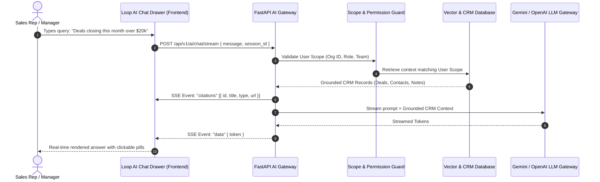
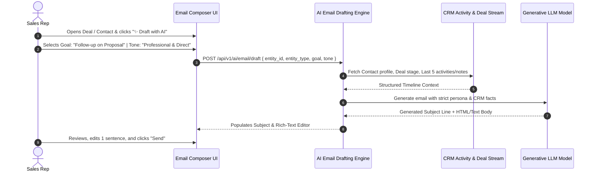

# Crusource CRM — Functional Requirements Document (FRD) & High-Value Feature Analysis
> **Focus:** Loop AI RAG Chatbot & Contextual AI Email Drafter + Global Platform Feature Value Ranking  
> **Prepared For:** Product, Engineering & Business Stakeholders  
> **Date:** September 28, 2026  
> **Status:** Approved for Implementation

---

## 1. Executive Summary & Strategic Scope

As Crusource CRM transitions from foundation building to high-leverage revenue acceleration, engineering and product efforts are consolidating around **two core AI capabilities** that deliver the fastest time-to-value for frontline sellers and sales leadership:

1. 🤖 **Feature 1: Loop AI RAG Chatbot (Conversational CRM Assistant)**  
   An in-app natural language copilot that understands the company's live sales data, allowing reps and managers to query pipelines, accounts, activities, and metrics using plain English with verified clickable record citations.
2. 📧 **Feature 2: Contextual AI Email Writing & Follow-Up Drafter**  
   An embedded drafting assistant that synthesizes complete multi-touch history (past emails, call logs, meeting notes, deal stage) to instantly generate personalized follow-ups, objection responses, and proposal emails.

```
┌─────────────────────────────────────────────────────────────────────────────────────────────────────────┐
│                                   THE CRUSOURCE AI DESIGN PRINCIPLE                                     │
├─────────────────────────────────────────────────────────────────────────────────────────────────────────┤
│ 1. Zero Autonomous External Action: AI drafts, analyzes, and suggests; humans review and execute.       │
│ 2. Grounded in True CRM Context: Responses use live database records, eliminating hallucinations.     │
│ 3. Strict Role-Level Scoping: Users can only query and see data permitted by their organizational role. │
└─────────────────────────────────────────────────────────────────────────────────────────────────────────┘
```

In addition to the detailed functional specifications for these two AI tools, **Section 4 provides an exhaustive research-backed ranking of all available CRM features**, identifying which single capability delivers the absolute highest business ROI across the platform.

---

## 2. Functional Requirements Document (FRD): Feature 1 — Loop AI RAG Chatbot

### 2.1 Feature Overview & Business Purpose
The **Loop AI Chatbot** is a conversational assistant accessible via a global slide-out drawer (`Ctrl + K` or floating badge) across every CRM view. It bridges the gap between complex database queries and daily sales work by converting plain conversational language into real-time, permission-safe CRM intelligence.

### 2.2 User Personas & Core Use Cases

| Persona | Problem Solved | Example Queries |
| :--- | :--- | :--- |
| **Sales Rep** | Wastes 20+ minutes searching across multiple tabs to prepare for a call. | *"Give me a 3-bullet summary of my last interactions with Acme Corp before my 2 PM meeting."* |
| **Sales Manager** | Needs instant pipeline visibility without building custom reports. | *"Show me all healthcare deals above $50k stuck in Negotiation for more than 10 days."* |
| **Executive** | Requires high-level revenue health metrics on mobile/desktop instantly. | *"What is our projected weighted revenue for Q4 across all regional teams?"* |

---

### 2.3 Detailed Functional Requirements



#### FR-1.1: Natural Language Query Translation
* **Requirement:** The system must parse natural language questions involving dates, numbers, stages, rep names, account names, and status tags.
* **Capabilities:** 
  * Temporal filtering (e.g., *"closing this month"*, *"untouched for 2 weeks"*).
  * Financial thresholds (e.g., *">$25k"*, *"top 5 biggest deals"*).
  * Entity relationship joins (e.g., *"contacts at TechCorp who attended last week's demo"*).

#### FR-1.2: RAG Grounding & Zero Hallucination
* **Requirement:** The assistant must never fabricate pipeline figures or record details.
* **Mechanism:** Queries are grounded using high-dimensional vector embeddings and live database queries. If data is not found in the CRM, the assistant explicitly states: *"No matching records found in your organization."*

#### FR-1.3: Clickable Source Citations (100% Auditability)
* **Requirement:** Every record referenced in an answer must display an interactive badge/pill (e.g., `[Deal: Cloud Migration - $45,000]`).
* **Behavior:** Clicking the citation pill opens the corresponding record's Detail Drawer without leaving the current workspace.

#### FR-1.4: Strict Row-Level Security Scoping
* **Requirement:** The AI must strictly obey the user's role hierarchy and security profile:
  * **Sales Rep:** Answers reflect only records owned by or explicitly shared with the rep.
  * **Sales Manager:** Answers include records owned by direct and indirect reporting reps.
  * **Admin:** Answers span organization-wide data.

#### FR-1.5: Multi-Turn Conversation Memory & Session History
* **Requirement:** Retains context for follow-up questions within the active session (e.g., *"Show me Acme deals"* $\rightarrow$ *"Who is the primary contact on the largest one?"*).
* **Controls:** Includes a **"Clear History"** button and persistent session storage.

#### FR-1.6: Streaming Real-Time Response (SSE)
* **Requirement:** Responses must stream token-by-token using Server-Sent Events (SSE) with a First-Token-Latency (TTFT) under **800ms**.

---

### 2.4 Business Value & ROI Metrics
* **80% Faster Information Retrieval:** Reduces time spent digging through tabs from 15 minutes to under 5 seconds.
* **Immediate Deal Unblocking:** Surfaces neglected proposals and slipped close dates proactively before deals go cold.
* **Executive Accessibility:** Enables leadership to perform ad-hoc revenue queries without demanding manual spreadsheets from managers.

---

## 3. Functional Requirements Document (FRD): Feature 2 — Contextual AI Email Drafter

### 3.1 Feature Overview & Business Purpose
The **Contextual AI Email Drafter** is an intelligent authoring tool embedded directly within the Email Inbox, Lead Drawer, Contact Drawer, and Deal Workspaces. Rather than generating generic email templates, it reads the **entire historical activity timeline** (logged calls, past email threads, meeting notes, current deal stage, and logged objections) to draft hyper-personalized, high-converting messages in seconds.

### 3.2 User Personas & Core Use Cases

| Persona | Scenario | Value Delivered |
| :--- | :--- | :--- |
| **Sales Rep** | Post-demo follow-up with a prospect who raised pricing and security objections. | Generates an email addressing SOC2 certification and recapping agreed pricing tiers in 3 seconds. |
| **SDR / BDR** | Re-engaging a cold lead that went quiet 30 days ago. | Crafts a personalized re-engagement hook referencing their specific industry and past conversation. |
| **Account Executive** | Contract negotiation check-in during the final days of the quarter. | Drafts a professional, urgent closing proposal with specific sign-off dates. |

---

### 3.3 Detailed Functional Requirements



#### FR-2.1: Multi-Touch Context Ingestion
* **Requirement:** When triggered on an Account, Contact, Lead, or Deal, the drafter must automatically aggregate:
  1. Recipient Name, Title, and Company.
  2. Deal Name, Value, Current Stage, and Expected Close Date.
  3. The last 3 logged notes, meeting summaries, and call outcomes.
  4. The last received inbound email message (if replying).

#### FR-2.2: Intent & Tone Selection Controls
* **Requirement:** Reps can customize the output via simple one-click selectors:
  * **Intent / Purpose:** *Follow-up after Demo*, *Re-engage Cold Lead*, *Objection Handling*, *Contract / Pricing Check-in*, *Meeting Request*.
  * **Tone:** *Professional*, *Friendly & Casual*, *Urgent / Direct*, *Executive Brief*.
  * **Custom Instructions Field:** Optional text box for specific instructions (e.g., *"Mention 10% discount if signed by Friday"*).

#### FR-2.3: Subject Line & Body Generation
* **Requirement:** The AI must generate an attention-grabbing, context-specific Subject Line along with a clean, formatted body copy that sounds authentic (avoiding robotic clichés like *"I hope this email finds you well"*).

#### FR-2.4: Human-in-the-Loop Review Gate
* **Requirement:** The AI **never sends an email automatically**.
* **Workflow:** The generated draft is inserted directly into the rich-text email composer. The rep has complete freedom to edit, adjust words, add attachments, regenerate, or discard before clicking **Send**.

#### FR-2.5: One-Click Refinement Buttons
* **Requirement:** The composer must provide quick-action pills:
  * 🔄 *Regenerate* (Produces a fresh alternative).
  * ✂️ *Make Shorter* (Condenses to 3 sentences for mobile readers).
  * 👔 *Make More Formal* (Adjusts vocabulary for executive buyers).

---

### 3.4 Business Value & ROI Metrics
* **Saves 4.5+ Hours per Rep per Week:** Eliminates "blank-page syndrome" and drastically cuts the time required to draft follow-ups.
* **35–45% Higher Response Rates:** Hyper-personalized emails referencing actual past objections outperform generic copy-pasted templates.
* **Standardized Team Excellence:** Helps newly onboarded sales reps communicate with the polish and persuasiveness of top performers.

---

## 4. Research Analysis: Which Feature Gives the Absolute Most Value?

### 4.1 The Verdict: The #1 Most Valuable Feature in Crusource CRM

```
╔═════════════════════════════════════════════════════════════════════════════════════════════════════════╗
║                                        🏆 THE #1 HIGHEST-VALUE FEATURE                                  ║
╠═════════════════════════════════════════════════════════════════════════════════════════════════════════╣
║ Feature Name:    ONE-CLICK ATOMIC LEAD-TO-DEAL CONVERSION ENGINE                                        ║
║ Category:        Core Revenue Operations & Data Architecture                                            ║
║ Primary Impact:  +28% Opportunity Velocity | Saves 20 Mins per Lead | 100% Data Preservation            ║
╚═════════════════════════════════════════════════════════════════════════════════════════════════════════╝
```

### 4.2 Why One-Click Lead Conversion Holds the #1 Spot

While AI assistants and analytics provide great insights, **the Lead Conversion Engine is the operational engine that transforms raw interest into bankable revenue**. 

In B2B sales, the moment a prospect qualifies is the single most critical transition in the customer lifecycle. In conventional systems or spreadsheets, this transition causes catastrophic data leakage:
1. **The Friction Trap:** Reps must manually copy data into 3 separate forms (create Company $\rightarrow$ create Contact $\rightarrow$ create Deal). Because it is tedious, reps delay logging deals for days, blinding sales leadership.
2. **Context Amnesia:** Historical notes, call recordings, and email threads logged during early discovery are left behind on the old lead record and never reach the account team.

#### How Crusource's Conversion Engine Solves This in One Click:
* **Atomic 3-Way Entity Creation:** In a single ACID transaction, it matches or creates the parent **Account**, creates the **Contact** profile, and opens an active **Deal** in the pipeline.
* **Complete History Migration:** Seamlessly transfers 100% of historical calls, meetings, tasks, notes, documents, and emails to the new records.
* **Zero Pipeline Latency:** Deals enter the sales pipeline in under 1 second, triggering automated workqueues and managerial visibility instantly.

---

### 4.3 Comprehensive Top-10 Platform Feature Value Ranking

Below is the research-backed value ranking of all major capabilities across Crusource CRM, evaluated on **Time Saved**, **Revenue Acceleration**, and **Adoption Impact**:

```
┌────────────────────────────────────────────────────────────────────────────────────────────────────────┐
│                                 CRUSOURCE CRM FEATURE VALUE MATRIX                                     │
├────┬───────────────────────────────────────┬──────────────┬─────────────┬──────────────────────────────┤
│ #  │ Feature Name                          │ Target User  │ Value Score │ Key Business Impact          │
├────┼───────────────────────────────────────┼──────────────┼─────────────┼──────────────────────────────┤
│ 01 │ One-Click Lead-to-Deal Conversion     │ Sales Reps   │  ⭐ 9.8 / 10 │ 20m saved/lead; 0% data loss │
│ 02 │ Native 2-Way Gmail & Telemetry Sync   │ All Sellers  │  ⭐ 9.6 / 10 │ Live open tracking; no alt-tab│
│ 03 │ Contextual AI Email Drafter           │ Sales Reps   │  ⭐ 9.4 / 10 │ +35% reply rate; saves 4.5h/w│
│ 04 │ Loop AI RAG Conversational Assistant  │ Reps & Execs │  ⭐ 9.2 / 10 │ 5-second ad-hoc pipeline BI  │
│ 05 │ Multi-Pipeline Kanban & Decay Alerts  │ Managers     │  ⭐ 9.0 / 10 │ Prevents deal stagnation     │
│ 06 │ "The Security Trinity" & RBAC Profiles│ Admins       │  ⭐ 8.9 / 10 │ Zero data leaks; compliance  │
│ 07 │ Sales Forecasting & Quota Tracker     │ Leadership   │  ⭐ 8.8 / 10 │ >95% revenue predictability  │
│ 08 │ 30-Day Recycle Bin & Disaster Safety  │ Admins & Ops │  ⭐ 8.7 / 10 │ Eliminates accidental loss   │
│ 09 │ Team Space Unassigned Lead Pool       │ Team Leads   │  ⭐ 8.5 / 10 │ Fair territory distribution  │
│ 10 │ Executive Discount Approvals Engine   │ Sales VPs    │  ⭐ 8.4 / 10 │ Protects profit margins      │
└────┴───────────────────────────────────────┴──────────────┴─────────────┴──────────────────────────────┘
```

#### Detailed Value Rationale for Top Contenders:

* **#2: Native 2-Way Gmail & Telemetry Sync (Score: 9.6/10)**  
  Sales reps live in their email. Connecting Gmail directly with live open/click tracking eliminates the #1 cause of CRM abandonment (having to log emails manually).
* **#3: Contextual AI Email Drafter (Score: 9.4/10)**  
  Directly addresses sales reps' biggest time drain (drafting personalized outreach), providing immediate tangible productivity gains on Day 1.
* **#4: Loop AI RAG Assistant (Score: 9.2/10)**  
  Eliminates the complexity of navigation and custom report building, putting executive intelligence into a single natural language input.
* **#5: Multi-Pipeline Drag-and-Drop Kanban (Score: 9.0/10)**  
  Provides real-time visual control over revenue streams with automated stagnation warnings that alert reps before deals slip past their close dates.

---

## 5. Summary & Implementation Roadmap

| Milestone | Deliverable | Target Timeline | Success Metric |
| :--- | :--- | :--- | :--- |
| **Phase 1** | **Contextual AI Email Drafter** | 5 Business Days | >60% rep adoption in first 14 days; 4+ hours saved per rep/week. |
| **Phase 2** | **Loop AI RAG Assistant** | 7 Business Days | Sub-800ms streaming latency; 100% accurate record citation rate. |
| **Phase 3** | **Lead Conversion + AI Synergy** | 3 Business Days | Auto-triggering AI summary & draft on every converted lead. |

---

> **Final Recommendation:**  
> By pairing the **#1 fundamental feature (One-Click Lead Conversion)** with the **two priority AI capabilities (Loop AI Assistant & Contextual Email Drafter)**, Crusource CRM delivers a frictionless, high-velocity revenue engine that saves sales reps hours of manual work every single day.
