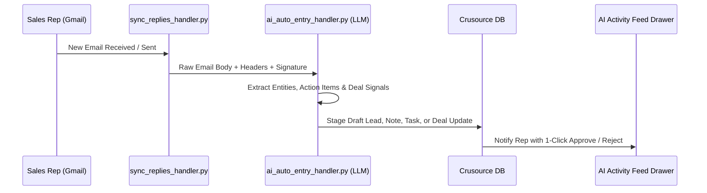
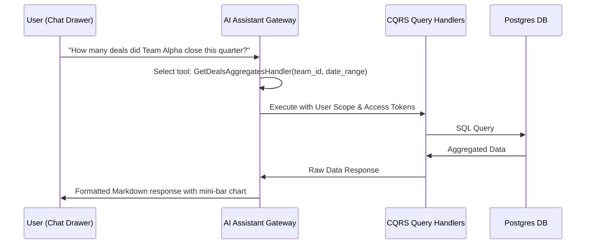
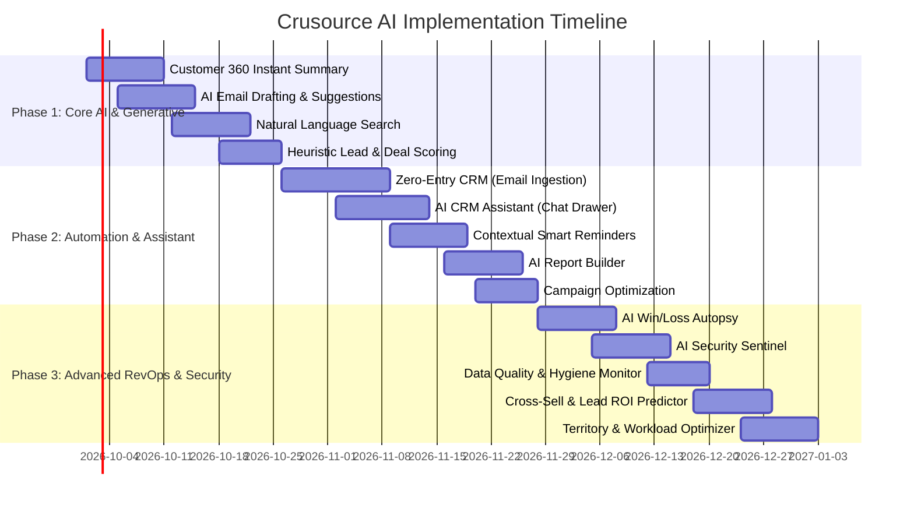

# 🚀 Crusource AI-First CRM: Strategic Product & Technical Implementation Plan

> **Executive Summary:**  
> This document outlines the comprehensive AI transformation plan for **Crusource CRM**. By integrating predictive machine learning, generative LLMs, and event-driven automation directly into our existing CQRS backend and modern React frontend, Crusource evolves from a passive system of record into an **active, intelligent revenue acceleration platform**.

---

## 📑 Table of Contents
1. [Strategic Vision & Architecture Overview](#-strategic-vision--architecture-overview)
2. [Feature Matrix & Categorization](#-feature-matrix--categorization)
3. [Pillar 1: Zero-Friction Data Capture & Automation](#-pillar-1-zero-friction-data-capture--automation)
4. [Pillar 2: Predictive Intelligence & Revenue Scoring](#-pillar-2-predictive-intelligence--revenue-scoring)
5. [Pillar 3: Generative AI & Customer Engagement](#-pillar-3-generative-ai--customer-engagement)
6. [Pillar 4: Conversational & Search Intelligence](#-pillar-4-conversational--search-intelligence)
7. [Pillar 5: Revenue Operations & Governance](#-pillar-5-revenue-operations--governance)
8. [Shared AI Technical Infrastructure](#-shared-ai-technical-infrastructure)
9. [Phased Rollout Roadmap](#-phased-rollout-roadmap)

---

## 🏗️ Strategic Vision & Architecture Overview

```mermaid
flowchart TB
    subgraph Data Sources & Ingestion
        GM[Gmail / Inbox Polling]
        DB[(PostgreSQL Database)]
        EV[Event Bus / CQRS State Changes]
        LH[LoginHistory & Audit Logs]
    end

    subgraph AI Gateway & Processing Engine
        LLM[LLM Gateway: Gemini / OpenAI\nStructured JSON & Function Calling]
        ML[Predictive ML Engine\nScikit-learn / LightGBM / Heuristics]
        CACHE[(Redis / Memory Cache)]
        SEC[RBAC & Record Access Scoping]
    end

    subgraph Core AI Pillars
        P1[1. Zero-Entry & Automation\nAuto-Create Records, Smart Reminders]
        P2[2. Predictive Intelligence\nDeal Win Rate, Lead Scoring, LTV/ROI]
        P3[3. Generative Engagement\nCustomer 360, Email Drafts, Campaigns]
        P4[4. Conversational Experience\nNL Search, AI Assistant, Report Builder]
        P5[5. RevOps & Governance\nWin/Loss Autopsy, Data Health, Sentinel]
    end

    subgraph Frontend User Experience
        UI1[Deal/Account/Contact Drawers & Badges]
        UI2[AI Floating Assistant Drawer]
        UI3[Email Composer Step & AI Drafts]
        UI4[Admin Threat & Data Health Dashboards]
    end

    GM & DB & EV & LH --> AI Gateway & Processing Engine
    LLM & ML & CACHE & SEC --> P1 & P2 & P3 & P4 & P5
    P1 & P2 & P3 & P4 & P5 --> UI1 & UI2 & UI3 & UI4
```

### Key Architectural Tenets
1. **CQRS Native Alignment**: AI functions sit cleanly on top of existing `QueryHandler` and `CommandHandler` abstractions. The AI acts as an orchestrator and translator rather than rebuilding custom query layers.
2. **Strict Security & RBAC**: Every AI data retrieval honors existing `resolve_record_access` rules, ensuring users only see what their organizational role permits.
3. **Hybrid Model Strategy**:
   - **Predictive/Statistical Models (Fast, Low Cost)**: Lead scoring, deal win-probability, send-time optimization, and security anomaly detection run locally via Scikit-learn/Heuristics (0 API costs).
   - **Generative LLMs (Context-Rich, High Value)**: Email synthesis, Customer 360 narratives, Function-calling Assistant, and NL-to-Query translation run via Gemini / OpenAI with aggressive token caching.
4. **Human-in-the-Loop Safeguards**: High-impact actions (auto-creating records, sending emails, reassignment) require explicit user review or one-click approval.

---

## 📊 Feature Matrix & Categorization

| # | Feature Name | Core Value | Model Type | Modules Touched |
|---|---|---|---|---|
| **01** | 📬 **Zero-Entry CRM** | Auto-creates leads, tasks & deal notes from incoming/outgoing emails | LLM (JSON Extraction) | `inbox`, `leads`, `contacts`, `deals`, `tasks` |
| **02** | 🔔 **Contextual Smart Reminders** | Event-driven reminders (deal stagnation, email opens) | Event Rules + Heuristics | `tasks`, `deals`, `leads`, `scheduler_service` |
| **03** | 🔮 **Deal Win-Probability Scoring** | Real-time 0–100% win probability badge with stagnation penalty | ML (Logistic Reg/GBDT) | `deals`, `stage_history`, `pipelines`, `forecast` |
| **04** | 🏷️ **Lead Scoring & Prioritization** | Predict conversion potential; auto-populate priority workqueue | Formula → ML | `leads`, `dashboard`, `teamspace` |
| **05** | 📨 **Email Engagement Predictor** | Pre-send open rate prediction & optimal send-time advisor | Statistical Analysis | `inbox`, `campaigns`, `contacts` |
| **06** | 🔄 **Cross-Sell & Upsell Engine** | Whitespace analysis & expansion timing for won accounts | Pattern Mining / ML | `accounts`, `deals`, `contacts`, `pipelines` |
| **07** | 💰 **Lead Source ROI Predictor** | Full-funnel source-to-revenue attribution and budget recommendations | Time-Series & Regression | `leads`, `deals`, `campaigns`, `accounts` |
| **08** | 📧 **AI Email Drafting & Suggestions** | Contextual reply and cold outreach drafting with tone control | LLM (Text Generation) | `inbox`, `campaigns`, `templates`, `contacts` |
| **09** | 🔎 **Customer 360 Instant Summary** | 1-click synthesized executive dossier on any account/contact | LLM (Summarization) | `accounts`, `contacts`, `deals`, `meetings`, `notes` |
| **10** | 📬 **AI Campaign Optimizer** | Subject line generator, send-time optimization, A/B winner detection | LLM + Stats | `campaigns`, `templates`, `contacts` |
| **11** | 🔍 **Natural Language CRM Search** | Plain English query translation into structured filters | LLM (Function / Filter Translation) | `search`, `leads`, `deals`, `contacts`, `accounts` |
| **12** | 🤖 **AI CRM Assistant (Chat)** | In-app conversational co-pilot executing live CQRS queries | LLM (Function Calling) | All Modules (Read-only Queries) |
| **13** | 📊 **AI Natural Language Report Builder**| Builds charts, pivot tables, and dashboard configs from plain text | LLM (Spec Generation) | `reports`, `analytics_boards`, `report_query_builder` |
| **14** | 🔬 **AI Win/Loss Autopsy** | Post-mortem root-cause analysis and team coaching on closed deals | LLM + Stage Analytics | `deals`, `stage_history`, `notes`, `meetings` |
| **15** | 🗺️ **Territory & Workload Optimizer** | Workload balancing, rep-deal fit scoring, intelligent re-assignment | Optimization / Heuristics | `teamspace`, `admin`, `deals`, `leads` |
| **16** | 🧹 **AI Data Quality Monitor** | Real-time data health score (0-100), detects stale/decayed/orphaned records | Anomaly Detection | `leads`, `contacts`, `accounts`, `data_admin` |
| **17** | 🛡️ **AI Security Sentinel** | Detects brute force, impossible travel, credential theft, bulk export abuse | Anomaly / Geo-Velocity | `login_history`, `audit_logs`, `admin` |

---

## ⚡ Pillar 1: Zero-Friction Data Capture & Automation

### 1. 📬 Zero-Entry CRM: Auto-Create Records from Email
*Eliminates the #1 CRM complaint: manual data entry.*



#### What It Does:
- **Lead/Contact Extraction**: Detects unknown senders/recipients, extracts name, job title, phone, and company from email signatures, and creates draft leads/contacts.
- **Automatic Note Logging**: Links inbound/outbound correspondence as clean timeline notes on relevant Lead/Contact/Deal records.
- **Action Item to Task Conversion**: Extracts commitments (*"I'll send the contract on Thursday"*) and automatically schedules tasks with due dates.
- **Deal Progression Signals**: Detects pricing or timeline discussions and suggests updating deal amounts or moving stages.

#### Technical Specifications:
- **Backend Handler**: `ai_auto_entry_handler.py` hooked into `sync_replies_handler.py` and `check_for_replies()`.
- **LLM Pipeline**: Few-shot JSON extraction schema (`{ contact: {...}, tasks: [...], deal_updates: {...}, summary: "..." }`).
- **Frontend Component**: `AiActivityFeedDrawer.tsx` displaying pending AI suggestions with bulk "Approve All" or inline adjustments.
- **Safety Control**: Auto-entries remain flagged as `is_ai_draft = True` until confirmed or auto-approved after configurable policy thresholds.

---

### 2. 🔔 AI Contextual Smart Reminders
*Replaces rigid time-based reminders with intelligent, event-driven triggers.*

```
Traditional: "Remind me in 3 days"
AI Smart:    "Remind me when the prospect opens the quote email" OR "Remind me if deal sits in Proposal stage 2x longer than average"
```

#### Trigger Types:
| Reminder Type | Trigger Condition | Target Entity |
|---|---|---|
| **Stagnation Nudge** | Deal duration in current stage exceeds $1.5 \times \text{Avg Stage Duration}$ | `Deals` |
| **Engagement Spike** | Recipient opened email $3+$ times or clicked proposal link | `Inbox / Contacts` |
| **Ghosting Alert** | No outbound/inbound interaction for 7 days on high-priority deal | `Deals / Leads` |
| **Meeting Prep Briefing** | 30 minutes before scheduled calendar event | `Meetings` |

#### Technical Specifications:
- **Backend Handler**: `ai_smart_reminder_handler.py` extending `scheduler_service.py` to evaluate conditional event rules.
- **Frontend Component**: Enhanced reminder dropdown in `TaskCreateModal.tsx` offering contextual dynamic triggers alongside standard static durations.

---

## 🎯 Pillar 2: Predictive Intelligence & Revenue Scoring

### 3. 🔮 AI Deal Win-Probability Scoring
*Real-time closing probability score (0–100%) and stagnation risk factor.*

#### Feature Signals & Weights:
```
Score = w₁·(Stage Benchmark Velocity) + w₂·(Touchpoint Density) + w₃·(Rep Historical Win Rate) + w₄·(Deal Size Fit) - w₅·(Regression Count)
```

| Signal in DB | Usage & Direction |
|---|---|
| `days_in_stage` vs `avg_stage_duration` | High stagnation significantly reduces probability |
| `stage_regression_count` from `stage_history` | Reverting to an earlier stage incurs penalty |
| Total meetings, calls, and logged notes | High multi-touch engagement increases probability |
| Deal amount relative to pipeline tier | Outsized deals receive risk-adjusted discount |
| Owner's historical win rate in this industry | Accountable rep competency factor |

#### Technical Specifications:
- **Model**: Scikit-Learn Logistic Regression / LightGBM model trained on closed-won/closed-lost records (fallback heuristic for cold-start).
- **Backend Handler**: `score_deal_handler.py` (runs on deal update events and scheduled nightly batch).
- **Frontend Component**: Colored probability badge (`DealWinProbabilityBadge.tsx`) in `DealDetailDrawer.tsx` and sortable score column in `deals/page.tsx`.
- **Forecast Engine Integration**: Integrates directly into `get_forecast_summary_handler.py` to replace static stage probabilities with weighted dynamic scores.

---

### 4. 🏷️ AI Lead Scoring & Prioritization
*Automatically ranks inbound leads to maximize rep focus on high-converting prospects.*

#### Scoring Matrix:
- **Source Authority**: Referral (+25), Organic Inbound (+15), Cold Outreach (+5).
- **Profile Match**: Industry / Company Size match with top 20% historic won customers (+20).
- **Campaign Engagement**: Email open rate, link clicks, website visits (+15).
- **Recency Decay**: Penalty calculated as $-\lambda \cdot (\text{days since last touchpoint})$.

#### Technical Specifications:
- **Backend Handler**: `ai_lead_score_handler.py` triggered on lead mutation or campaign webhook events.
- **Frontend Integration**: "AI Priority Score" column in `leads/page.tsx` and direct sorting inside `PriorityWorkqueueWidget.tsx` on `DashboardHome.tsx`.

---

### 5. 📨 Email Engagement Predictor
*Pre-send optimization tool to maximize open and response rates.*

```
Input Subject: "Checking in on the contract" ───► AI Score: 22% Open Likelihood
AI Suggestion: "Revised timeline for Crusource rollout" ───► AI Score: 48% Open Likelihood
Recommended Send Time: Tuesday at 10:15 AM (based on 14 past opens from this recipient)
```

#### Technical Specifications:
- **Backend Handler**: `ai_email_engagement_handler.py` querying `EmailTracking.opens` timestamps, `CampaignRecipient.is_opened`, and `TrackedThread` response deltas.
- **Frontend Integration**: Engagement prediction pill and "Best Time to Send" widget inside `EmailComposerStep.tsx` and `ContactDetailDrawer.tsx`.

---

### 6. 🔄 Cross-Sell & Upsell Recommendation Engine
*Identifies whitespace opportunities and expansion timing for existing accounts.*

#### What It Does:
- **Whitespace Analysis**: Identifies products/modules adopted by peer accounts within the same vertical that are absent in the target account.
- **Expansion Timing Window**: Triggers alerts when accounts reach their historical expansion milestone (e.g., Month 4 to 6 post initial close).
- **Opportunity Generation**: Provides 1-click deal creation populated with suggested package size and pitch talking points.

#### Technical Specifications:
- **Backend Handler**: `ai_cross_sell_handler.py` analyzing `Account` $\rightarrow$ `Deal` graphs grouped by vertical.
- **Frontend Integration**: "Expansion Opportunities" card on `AccountOverviewTab.tsx`.

---

### 7. 💰 Lead Source ROI Predictor
*Full-funnel attribution connecting acquisition channels to closed revenue and predicted customer lifetime value.*

#### Capabilities:
- **True ROI Calculation**: Computes CAC vs. Realized Net Revenue per lead source.
- **Budget Allocation Recommendations**: Recommends budget reallocations based on conversion velocity and average deal size.
- **Time-Decay Attribution**: Detects declining channel performance before manual quarterly reviews.

#### Technical Specifications:
- **Backend Handler**: `ai_lead_source_roi_handler.py` joining `Lead.lead_source` $\rightarrow$ `Deal.amount` $\rightarrow$ `Deal.stage_type (won)`.
- **Frontend Integration**: Enhanced `LeadSourceIntelligenceCard.tsx` on `DashboardHome.tsx` with predictive ROI forecasting charts.

---

## ✍️ Pillar 3: Generative AI & Customer Engagement

### 8. 📧 AI Email Drafting & Reply Suggestions
*Context-aware drafting for cold emails, follow-ups, and negotiation threads.*

```
Context Loaded:
- Contact: Priya Shah (VP Eng)
- Deal: Enterprise Tier ($45k)
- Last Note: "Concerned about SOC2 compliance and SSO integration"
- Intent: Reassure on security and book 15-min call

Output Generated:
"Hi Priya,
Following up on our discussion regarding security. Crusource is fully SOC2 Type II certified and supports Okta/SAML out of the box. I've attached our compliance packet. Do you have 15 minutes this Thursday at 2 PM to review the SSO architecture with our solutions engineer?
Best, [Rep Name]"
```

#### Technical Specifications:
- **Backend Handler**: `ai_draft_email_handler.py` in `inbox/handlers/`. Accepts thread context, entity metadata, and tone prompt; calls LLM Gateway.
- **Frontend Component**: "✨ Draft with AI" quick-action in `EmailComposerStep.tsx` and 1-click suggested reply pills in `EmailMessageItem.tsx`.
- **Safety Standard**: Draft is inserted into the editor for human review and final send (never sent autonomously).

---

### 9. 🔎 Customer 360 Instant Summary
*1-click executive intelligence summary synthesizing complete account history.*

```markdown
📋 Acme Corp — 360 Intelligence Dossier (Updated 2m ago)
━━━━━━━━━━━━━━━━━━━━━━━━━━━━━━━━━━━━━━━━━━━━━━━━━━━━━━━━━━━━━━━━
• RELATIONSHIP: Active client since Mar 2026. 2 Won Deals ($48k ARR).
• KEY PLAYERS: Rahul Mehta (VP Eng, Champion), Deepa Rao (CFO, Economic Buyer - Unmet).
• RECENT TOUCHPOINTS: Demo completed 3 days ago. 1 overdue security questionnaire task.
• ACTIVE DEAL: "Enterprise Expansion" ($25k, Negotiation). Stalled 6 days above stage average.
• SENTIMENT & RISK: 4/5 positive interactions. Primary friction point: API rate limits.
━━━━━━━━━━━━━━━━━━━━━━━━━━━━━━━━━━━━━━━━━━━━━━━━━━━━━━━━━━━━━━━━
⚡ RECOMMENDED NEXT BEST ACTIONS:
1. Send API rate limit whitepaper to Rahul Mehta.
2. Request introduction to Deepa Rao (CFO) for commercial signoff.
```

#### Technical Specifications:
- **Backend Handler**: `ai_customer_360_handler.py` aggregating `accounts`, `contacts`, `deals`, `meetings`, `calls`, `notes`, `tasks`, and `tickets`.
- **Performance & Cache**: Synthesized summaries are cached in Redis/PostgreSQL for 24 hours with an on-demand "🔄 Refresh AI Summary" button.
- **Frontend Component**: Prominent "🧠 AI 360 Summary" banner on `AccountOverviewTab.tsx` and `ContactDetailDrawer.tsx`.

---

### 10. 📬 AI Campaign Optimizer
*Automated campaign effectiveness and conversion rate booster.*

#### Core Features:
1. **Subject Line Generator**: Produces 3-5 variations scored by predicted open rate.
2. **Autonomous A/B Winner Selection**: Continuously evaluates open/click sample distributions and automatically promotes winning variants using Bayesian confidence calculations.
3. **Audience Segment Recommender**: Scans past campaign responders to suggest target filters for upcoming broadcasts.

#### Technical Specifications:
- **Backend Handler**: `ai_campaign_optimizer_handler.py` integrated into `campaigns` telemetry engine.
- **Frontend Component**: Subject Line Assistant in `CampaignComposer.tsx` and winner badge inside `CampaignAbAnalyticsCard.tsx`.

---

## 💬 Pillar 4: Conversational & Search Intelligence

### 11. 🔍 Natural Language CRM Search
*Translates everyday spoken/typed questions directly into structured filter parameters.*

```
User Query:   "deals over 50k in negotiation closing this month in Bangalore"
Translates to: {
  "module": "deals",
  "filters": {
    "amount": { "gte": 50000 },
    "stage": "negotiation",
    "close_date": { "gte": "2026-09-01", "lte": "2026-09-30" },
    "account.city": "Bangalore"
  }
}
```

#### Technical Specifications:
- **Backend Handler**: `ai_search_handler.py` utilizing structured output schemas matching existing `LeadFilterParams` / `DealFilterParams`.
- **Frontend Component**: Omnibar search input in `searchAdapters.ts` with real-time "Parsed Filter Tags" allowing users to inspect and adjust the query before executing.

---

### 12. 🤖 AI CRM Assistant (Chat Interface)
*In-app conversational assistant with real-time function calling over your CQRS Query handlers.*



#### Supported Tool Mappings:
- `ListDealsQueryHandler` / `GetDealsAggregatesHandler`
- `ListLeadsQueryHandler` / `GetLeadSummaryHandler`
- `ListTasksQueryHandler` (e.g., "What are my high-priority overdue tasks?")
- `GetTeamPerformanceHandler`

#### Technical Specifications:
- **Backend Handler**: `ai_assistant_service.py` with multi-turn conversation memory and strict parameter validation.
- **Frontend Component**: Slide-out `AiAssistantDrawer.tsx` accessible globally across all CRM views via `Ctrl + K` or floating badge.
- **Security Scoping**: Enforces `resolve_record_access` on every invoked tool.

---

### 13. 📊 AI Natural Language Report Builder
*Instantly creates custom charts, pivot tables, and dashboard widgets from text instructions.*

#### Examples:
- *"Show me quarterly revenue by pipeline type as a stacked bar chart"*
- *"Lead conversion rates by industry over the past 12 months as a line chart"*
- *"Top 10 accounts by total lifetime closed value"*

#### Technical Specifications:
- **Backend Handler**: `ai_report_builder_handler.py` generating valid `ReportSpec` JSON.
- **Validation**: Verified against `get_compatible_chart_types()` and `get_report_fields()` in `report_query_builder.py`.
- **Frontend Component**: "✨ Build with AI" modal inside `ReportsHome.tsx` and `AnalyticsBoards.tsx`.

---

## 🛡️ Pillar 5: Revenue Operations & Governance

### 14. 🔬 AI Win/Loss Autopsy
*Automated forensic post-mortems on closed deals to uncover systemic revenue drivers and bottlenecks.*

#### What It Analyzes:
- **Deal Timeline Velocity**: Stage duration anomalies, regression patterns, and approval delays.
- **Stakeholder Engagement**: Multi-threading analysis (number of contacts involved vs. single-threaded risk).
- **Touchpoint Frequency**: Note density, meeting count, and email latency prior to deal close.
- **Systemic Patterns**: Aggregates insights across the sales org (e.g., *"Deals involving a technical demo within 7 days have a $3.2\times$ higher close rate"*).

#### Technical Specifications:
- **Backend Handler**: `ai_win_loss_handler.py` triggered when `deal.stage_type` changes to `won` or `lost`.
- **Frontend Component**: "📊 Win/Loss Post-Mortem" tab on closed deals in `DealDetailDrawer.tsx` and Org-Level Insights widget.

---

### 15. 🗺️ AI Territory & Workload Optimizer
*Balances pipeline distribution and matches incoming prospects with the best-fit sales rep.*

#### Optimization Dimensions:
1. **Workload Capacity**: Prevents rep burnout by balancing active deal loads across team tiers.
2. **Industry / Deal-Size Fit**: Directs high-value manufacturing deals to reps with proven historical win rates in manufacturing.
3. **Automated Reassignment**: Integrates with `record_transfer_service.py` to suggest re-allocations with 1-click execution.

#### Technical Specifications:
- **Backend Handler**: `ai_territory_optimizer_handler.py` analyzing `teamspace`, `RoleTreeNode`, and rep win rates.
- **Frontend Component**: "Workload Health & Rebalancing" panel inside `UserHierarchyCanvas.tsx` and `TeamLeaderboardTable.tsx`.

---

### 16. 🧹 AI Data Quality Monitor
*Proactive health score and autonomous cleanup for CRM database integrity.*

```
Overall CRM Health Score: 88 / 100 [A-]
━━━━━━━━━━━━━━━━━━━━━━━━━━━━━━━━━━━━━━━━━━━━━━━━━
⚠️ 34 Leads missing verified contact numbers
⚠️ 12 Contacts unlinked to any active Account or Deal (Orphaned)
⚠️ 5 Formats detected in phone number fields (Auto-Format Ready)
⚠️ 18 Stale Accounts with zero touchpoints in > 180 days
━━━━━━━━━━━━━━━━━━━━━━━━━━━━━━━━━━━━━━━━━━━━━━━━━
[⚡ Bulk Auto-Format Clean]  [🔍 Review Stale Accounts]
```

#### Technical Specifications:
- **Backend Handler**: `ai_data_quality_handler.py` running nightly cron scans applying validation rules and outlier detection.
- **Frontend Component**: `DataHealthScoreCard.tsx` on the Admin dashboard with 1-click bulk repair actions leveraging `data_admin` and `OrphanCleanupCard.tsx`.

---

### 17. 🛡️ AI Security Sentinel
*Real-time threat detection and credential protection leveraging rich login telemetry.*

#### Threat Detection Matrix:
| Threat Pattern | Telemetry Signals Used | Action Taken |
|---|---|---|
| **Brute Force Attack** | $\ge 5$ failed logins within 2 minutes per IP / User | Temporary IP lock + Admin Alert |
| **Impossible Travel** | Logins from distinct geographic regions within impossible travel time | Force MFA Challenge + Session Terminate |
| **Device / Browser Anomaly** | First-time OS/Browser fingerprint from high-privilege Admin role | In-app notification + Email confirmation |
| **Mass Data Exfiltration** | Single user exporting $>1,000$ records via audit logs in one session | Rate limit export + Immediate Admin Alert |

#### Technical Specifications:
- **Backend Handler**: `ai_security_sentinel_handler.py` evaluating `LoginHistory` (IP, device, browser, OS, failure reasons) + `audit_logs`.
- **Frontend Component**: "🛡️ Security Threat Dashboard" in `admin/security` with real-time SSE alerts.

---

## ⚙️ Shared AI Technical Infrastructure

```
backend/
└── app/
    ├── ai/
    │   ├── __init__.py
    │   ├── core/
    │   │   ├── llm_gateway.py          # Unified OpenAI/Gemini client with caching & fallback
    │   │   ├── prompt_templates.py     # Versioned, structured prompts
    │   │   ├── token_meter.py          # Tracks tenant & user token usage
    │   │   └── embeddings.py           # Vector embeddings for semantic search & matching
    │   ├── ml/
    │   │   ├── deal_scorer.py          # Scikit-learn win probability pipeline
    │   │   ├── lead_scorer.py          # Conversion probability model
    │   │   └── anomaly_detector.py     # Isolation Forest / Z-score security analyzer
    │   └── handlers/
    │       ├── ai_auto_entry_handler.py
    │       ├── ai_customer_360_handler.py
    │       ├── ai_search_handler.py
    │       ├── ai_assistant_handler.py
    │       ├── ai_report_builder_handler.py
    │       ├── ai_draft_email_handler.py
    │       ├── ai_smart_reminder_handler.py
    │       ├── ai_win_loss_handler.py
    │       ├── ai_data_quality_handler.py
    │       └── ai_security_sentinel_handler.py
```

### Core Shared Services
1. **`llm_gateway.py`**:
   - Manages API calls, structured JSON outputs, retry policies, and temperature control.
   - Transparent response caching for repetitive queries (like Customer 360 summaries).
2. **`token_meter.py`**:
   - Enforces rate-limiting and budget controls per organization/user.
3. **Event-Driven Hooks**:
   - Integrates with existing CQRS command handlers to trigger asynchronous scoring and data quality indexing without blocking HTTP responses.

---

## 📅 Phased Rollout Roadmap



### Phase Summary:
- **Phase 1 (Weeks 1–4) — Immediate Productivity & "Wow" Factor**:
  - Customer 360 Summaries, AI Email Drafter, NL Search, and Core Deal/Lead Scoring.
- **Phase 2 (Weeks 5–8) — Autonomous Workflows & Conversational CRM**:
  - Zero-Entry CRM from Gmail, Floating AI Assistant, Contextual Reminders, and NL Report Builder.
- **Phase 3 (Weeks 9–12) — Enterprise RevOps, Governance & Security**:
  - Win/Loss Autopsies, Security Sentinel, Data Quality Monitor, and Predictive Territory Optimization.

---

> [!TIP]
> **Next Step**: Once you approve this structured plan, we can begin implementing **Phase 1** starting with `llm_gateway.py` and the **Customer 360 Instant Summary** or **AI Email Drafting** modules!
