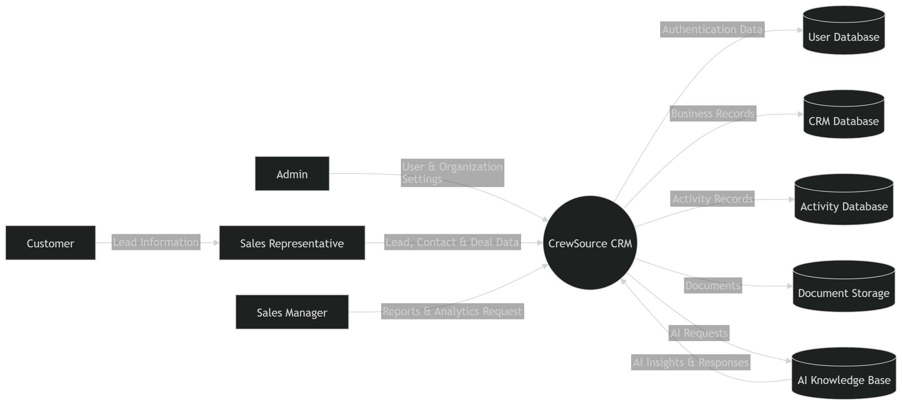
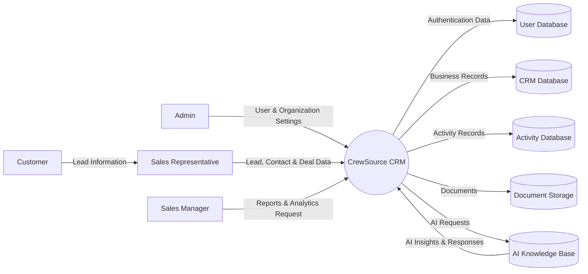
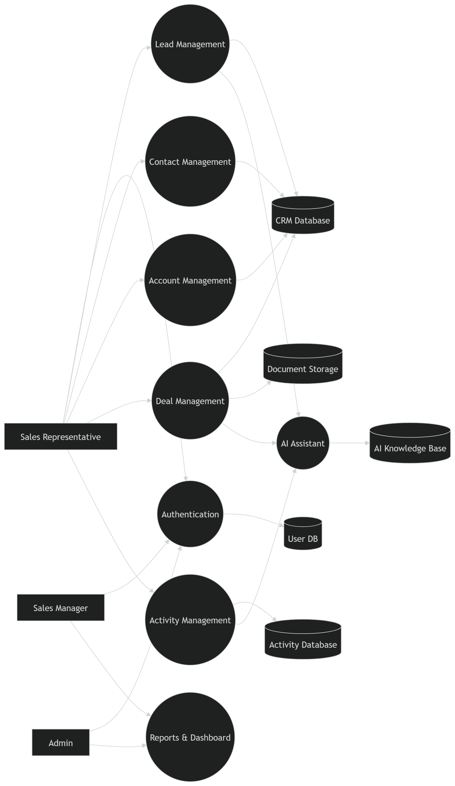
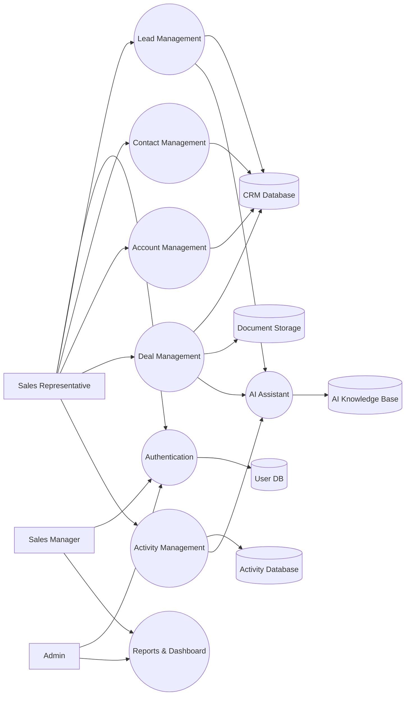
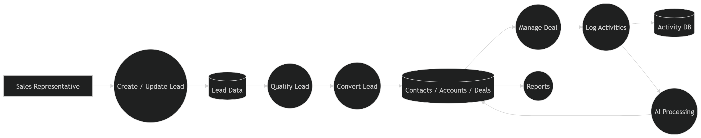
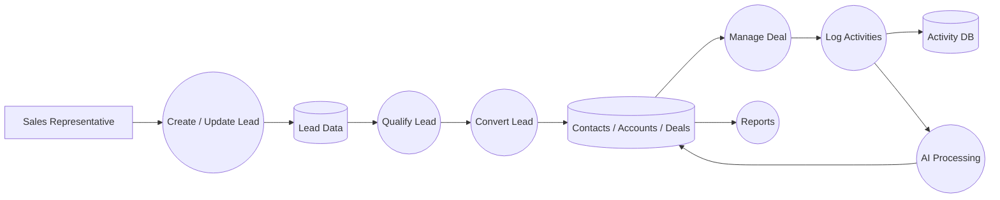

# Data Flow Diagram (DFD)

**Version:** 1.0
**Project:** Crusource CRM
**Prepared By:** Team Crusource

---

## Table of Contents

1. [Introduction](#1-introduction)
2. [DFD Symbols](#2-dfd-symbols)
3. [External Entities](#3-external-entities)
4. [Data Stores](#4-data-stores)
5. [DFD Level 0 – Context Diagram](#5-dfd-level-0--context-diagram)
6. [DFD Level 1 – System Overview](#6-dfd-level-1--system-overview)
7. [DFD Level 2 – Detailed CRM Flow](#7-dfd-level-2--detailed-crm-flow)
8. [Overall CRM Data Flow](#8-overall-crm-data-flow)
9. [Conclusion](#9-conclusion)

---

# 1. Introduction

The **Crusource CRM** is designed to manage the complete sales lifecycle of an organization — from capturing potential customers as Leads to closing Deals and maintaining customer relationships. The CRM also provides activity tracking, reporting, document management, and AI-powered assistance to improve sales productivity.

A **Data Flow Diagram (DFD)** illustrates how data moves between users, system processes, databases, and external services. It focuses on **how information flows through the system**, rather than how the software is implemented.

---

# 2. DFD Symbols

| Symbol | Meaning |
|---|---|
| External Entity | A person or external system interacting with the CRM |
| Process | A system function that processes data |
| Data Store | A location where data is stored |
| Data Flow | Information moving between entities, processes, and data stores |

---

# 3. External Entities

| Entity | Description |
|---|---|
| Admin | Manages users, permissions, reports, and organization settings. |
| Sales Manager | Monitors team performance and oversees the sales pipeline. |
| Sales Representative | Manages leads, contacts, accounts, deals, and daily activities. |
| Customer | Provides lead information and participates in meetings, calls, and deals. |
| AI Knowledge Base | Provides AI-powered recommendations, meeting summaries, lead insights, and chatbot responses. |

---

# 4. Data Stores

| Data Store | Description |
|---|---|
| User Database | Users, roles, permissions |
| CRM Database | Leads, Contacts, Accounts, Deals |
| Activity Database | Tasks, Meetings, Calls, Notes |
| Document Storage | Uploaded proposals, contracts, quotations |
| AI Knowledge Base | Embeddings, summaries, chatbot context |

---

# 5. DFD Level 0 – Context Diagram

## DFD Diagram


*Figure 1: Level 0 Context Diagram*

<details>
<summary>Mermaid source</summary>



</details>

---

## Explanation

The Level 0 Context Diagram represents the Crusource CRM as a single system that interacts with external entities.

- The **Admin** manages users, roles, and organizational settings.
- The **Sales Representative** performs daily sales operations such as managing leads, contacts, deals, and activities.
- The **Sales Manager** monitors team performance and generates reports.
- The **Customer** provides lead information to the **Sales Representative**, who records and manages it within the CRM.
- The CRM processes these interactions, stores information in dedicated databases, and communicates with the AI Knowledge Base to provide intelligent assistance and automation.

This diagram provides a high-level overview of how external entities interact with the CRM without exposing internal business processes.

---

## Data Flow Table

| Flow | Source               | Destination          | Data                         | Purpose                            |
| ---- | -------------------- | -------------------- | ---------------------------- | ---------------------------------- |
| F1   | Customer             | Sales Representative | Lead Information             | Provide potential customer details |
| F2   | Admin                | CrewSource CRM       | User & Organization Settings | Manage users and settings          |
| F3   | Sales Representative | CrewSource CRM       | Lead, Contact & Deal Data    | Perform sales operations           |
| F4   | Sales Manager        | CrewSource CRM       | Reports & Analytics Requests | Monitor business performance       |
| F5   | CrewSource CRM       | User Database        | Authentication Data          | Store user credentials             |
| F6   | CrewSource CRM       | CRM Database         | Business Records             | Store CRM information              |
| F7   | CrewSource CRM       | Activity Database    | Activity Records             | Store customer interactions        |
| F8   | CrewSource CRM       | Document Storage     | Documents                    | Store uploaded files               |
| F9   | CrewSource CRM       | AI Knowledge Base    | AI Requests                  | Request AI-powered assistance      |
| F10  | AI Knowledge Base    | CrewSource CRM       | AI Insights & Responses      | Return AI-generated insights       |


---

# 6. DFD Level 1 – System Overview

## DFD Diagram


*Figure 2: Level 1 System DFD*

<details>
<summary>Mermaid source</summary>



</details>

---

## Explanation

The Level 1 DFD decomposes the CRM into its major functional processes.

Users first authenticate themselves through the Authentication process. Once authenticated, Sales Representatives interact with Lead Management, Contact Management, Account Management, Deal Management, and Activity Management. Sales Managers and Admins primarily interact with the Reporting module to monitor business performance.

Each process exchanges data with the appropriate database, while AI-enabled modules communicate with the AI Knowledge Base to generate intelligent suggestions, summaries, and recommendations.

---

## Data Flow Table

| Flow | Source | Destination | Data | Purpose |
|---|---|---|---|---|
| F1 | User | Authentication | Login Credentials | Verify user identity |
| F2 | Authentication | User Database | User Credentials | Validate access |
| F3 | Sales Representative | Lead Management | Lead Information | Manage leads |
| F4 | Sales Representative | Contact Management | Contact Details | Manage contacts |
| F5 | Sales Representative | Account Management | Company Information | Manage accounts |
| F6 | Sales Representative | Deal Management | Deal Details | Manage opportunities |
| F7 | Sales Representative | Activity Management | Calls, Meetings & Tasks | Record customer interactions |
| F8 | Sales Manager / Admin | Reports & Dashboard | Report Requests | Monitor CRM performance |
| F9 | Lead / Contact / Account / Deal Management | CRM Database | Business Data | Store and retrieve CRM records |
| F10 | Lead / Deal / Activity Management | AI Knowledge Base | AI Context | Generate AI responses |

---

# 7. DFD Level 2 – Detailed CRM Flow

## DFD Diagram


*Figure 3: Level 2 Detailed CRM Workflow*

<details>
<summary>Mermaid source</summary>



</details>

---

## Explanation

The Level 2 DFD illustrates the CRM's core business workflow, beginning with lead creation and ending with business reporting.

A Sales Representative creates or updates lead information, which is stored in the Lead Database. Qualified leads are evaluated and converted into Contacts, Accounts, and Deals within the CRM Database. As deals progress through the sales pipeline, all customer interactions are recorded in the Activity Database.

The collected activity data is then processed by AI services to generate intelligent insights, recommendations, and automation. Finally, the processed business data is used to generate reports and analytics for managers and administrators.

---

## Data Flow Table

| Flow | Source | Destination | Data | Purpose |
|---|---|---|---|---|
| F1 | Sales Representative | Lead Management | Lead Information | Create or update leads |
| F2 | Lead Management | Lead Database | Lead Data | Store lead records |
| F3 | Lead Database | Lead Qualification | Lead Details | Evaluate lead quality |
| F4 | Lead Qualification | Lead Conversion | Qualified Lead | Convert lead |
| F5 | Lead Conversion | CRM Database | Contact, Account & Deal Data | Create customer records |
| F6 | CRM Database | Deal Management | Deal Information | Manage sales opportunities |
| F7 | Deal Management | Activity Management | Customer Activities | Track customer interactions |
| F8 | Activity Management | Activity Database | Calls, Meetings & Tasks | Store activities |
| F9 | Activity Management | AI Processing | Activity Context | Generate AI insights |
| F10 | AI Processing | CRM Database | AI Suggestions | Enhance CRM data |
| F11 | CRM Database | Reports | Business Data | Generate reports and analytics |

---

# 8. Overall CRM Data Flow

The CRM follows a structured sequence of data movement:

```text
User Authentication
        │
        ▼
Lead Management
        │
        ▼
Lead Qualification
        │
        ▼
Lead Conversion
        │
 ┌──────┼─────────┐
 ▼      ▼         ▼
Contact Account  Deal
                  │
                  ▼
          Activity Management
                  │
                  ▼
             AI Processing
                  │
                  ▼
        Reports & Analytics
```

---

# 9. Conclusion

The DFD provides a clear representation of how information moves through the Crusource CRM. By progressively refining the system from the Context Diagram (Level 0) to the Detailed Business Process (Level 2), stakeholders can easily understand the interaction between users, system processes, data stores, and AI components. This document serves as a reference for system design, development, and future enhancements.
