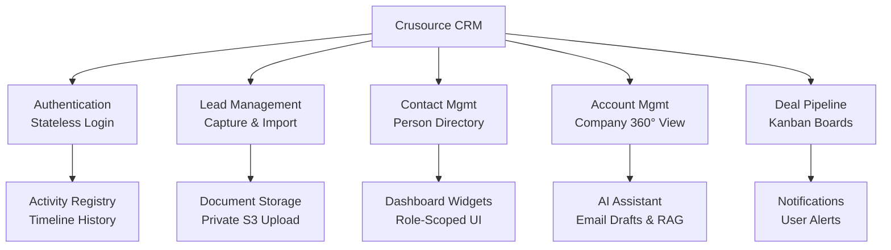
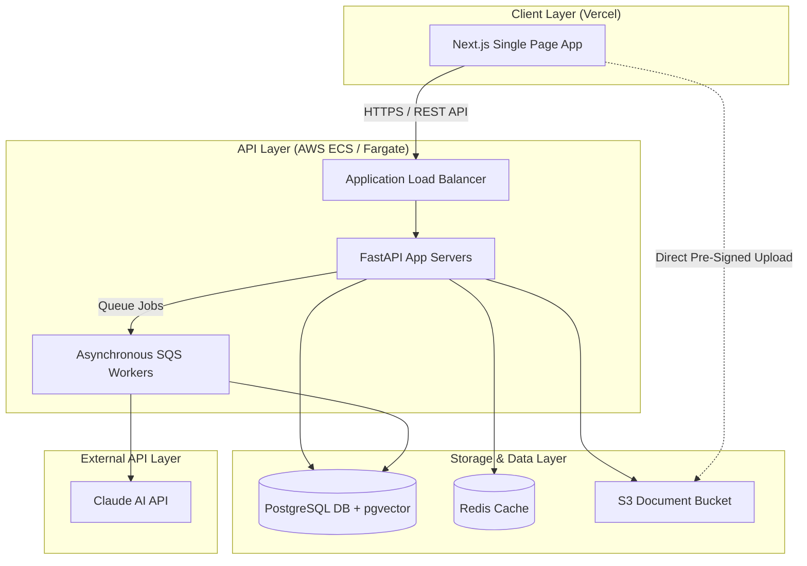
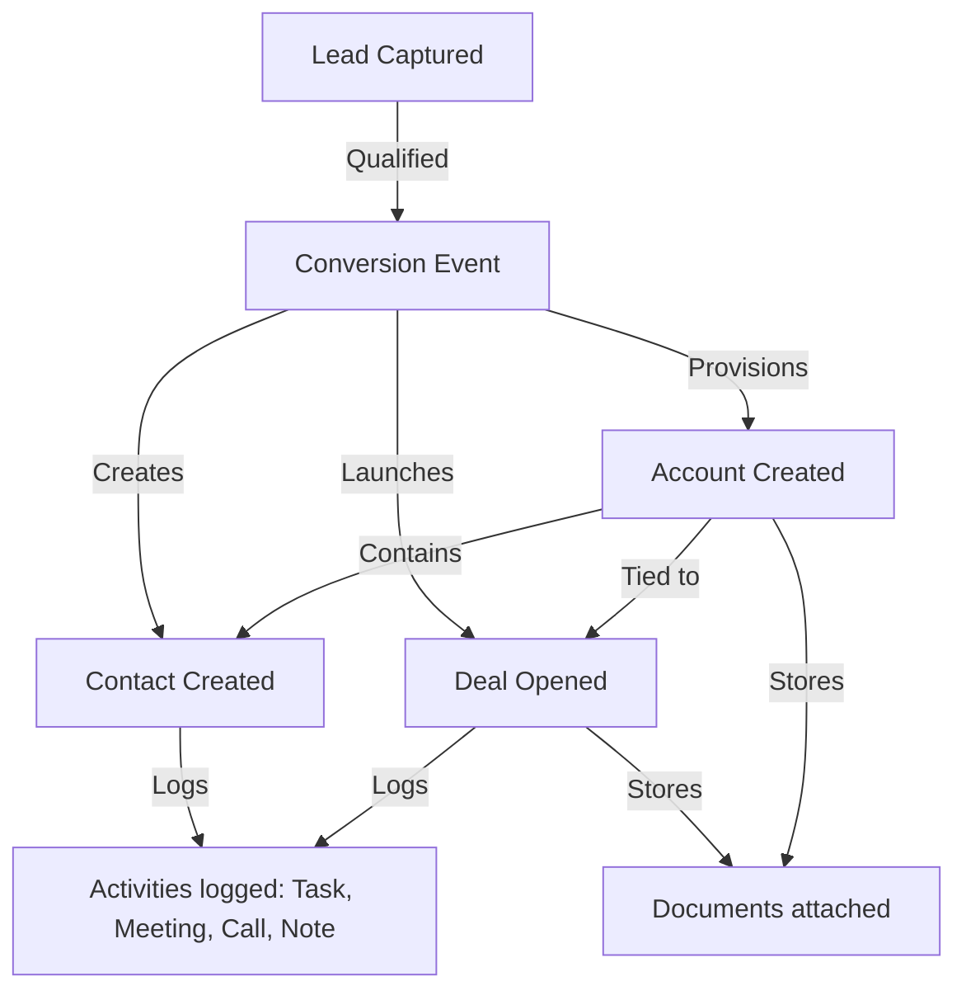
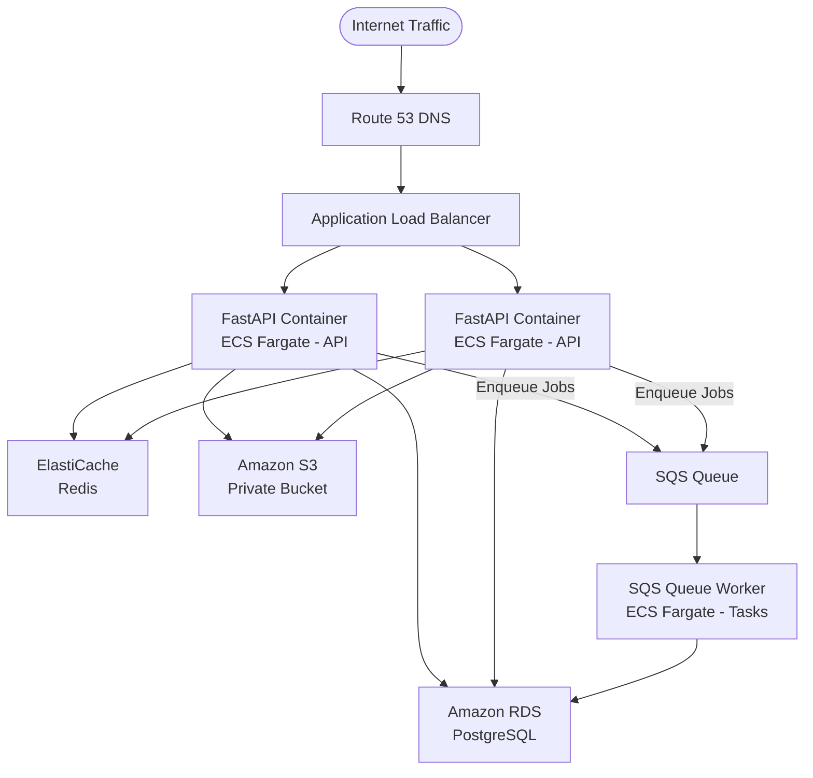
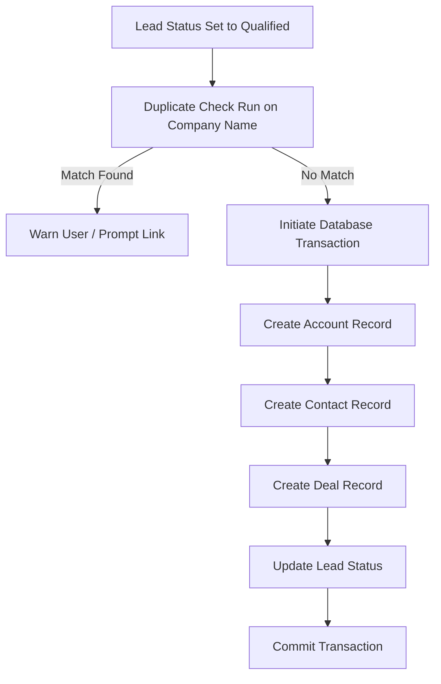
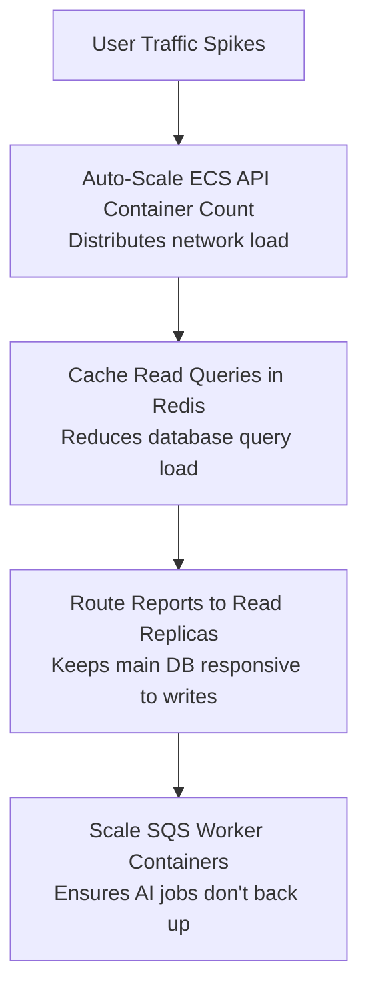

# Crusource CRM — High-Level Design (HLD)

---

## 1. Introduction

### Project Overview
**Crusource CRM** is a cloud-based Software-as-a-SaaS customer relationship management system. It aims to unify the sales pipeline of Small and Medium Enterprises (SMEs) by offering a consolidated workspace that tracks leads, contacts, accounts, deals, activities, and documents under a single multi-tenant infrastructure.

### Problem Statement
SMEs often struggle with fragmented sales tracking across disparate spreadsheets, emails, and notes. This leads to lost opportunity visibility, lack of consistent follow-ups, and time wasted on manual administrative work. Additionally, existing CRMs can be overly complex and lack native AI email drafting and risk alerts to help reps work faster.

### Objectives
*   **Consolidate Sales Funnel:** Provide a single source of truth for the entire customer journey, from cold lead to closed deal.
*   **Enhance Rep Productivity:** Integrate AI assistance directly into normal workflows (e.g., draft emails, lead scoring) without requiring custom prompts.
*   **Enforce Security and Tenant Isolation:** Build a multi-tenant workspace where each SME's data is strictly isolated.
*   **Deliver Responsive UI/UX:** Offer intuitive, fast-loading pipelines, dashboards, and Kanban views.

### Scope
The initial version (V1) includes:
*   Standard CRM modules: Leads, Contacts, Accounts, Deals, Activities, Documents.
*   Administrative utilities: User onboarding, managers reporting trees, and permissions controls.
*   AI capabilities: Scoring engine, email drafting, chatbot assistant (RAG), and risk monitoring.
*   *Out of scope for V1:* Advanced custom report builders, third-party email client syncing, and custom database fields.

### Target Users
*   **Sales Representatives:** Power users logging activities, managing opportunities, and writing follow-ups.
*   **Sales Managers:** Supervisors assigning targets, reviewing team dashboards, and diagnosing pipeline health.
*   **Administrators:** Operations managers setting stages, adjusting system parameters, and onboarding new staff.

---

## 2. Functional Overview

The CRM system is organized into major high-level modules:

*   **Authentication:** Multi-tenant credential verification and role assignment.
*   **Lead Management:** Ingestion of early-stage targets, CSV importing, status tracking, and conversion triggers.
*   **Contact Management:** Contact details, links to parent accounts, and communication logs.
*   **Account Management:** Centralized company profiles mapping linked contacts, historical deals, and activities.
*   **Deal Pipeline:** Sales progression tracker through customizable stages with aggregated values.
*   **Activity Registry:** Unified logging of tasks, scheduled meetings, logged calls, and freeform notes.
*   **Document Storage:** File attachments associated with deals or accounts.
*   **Dashboard Widgets:** Metrics summarized by role to show what matters to the rep, manager, or admin.
*   **AI Assistant:** Smart lead score assignments, email drafts, and search-backed chatbot.
*   **Notifications:** System alerts notifying owners of upcoming deadlines, new records, or deal risks.
*   **Admin Settings:** Control panel for pipeline stages, lead priority weights, and active user directories.

---

## 3. User Roles

Access rights and view scopes are partitioned strictly according to the user's role:

| Role | Core Responsibilities | Data View Scope |
|---|---|---|
| **Admin** | Manages organization setup, adds users, sets pipeline stages, adjusts scoring weights, and transfers data. | Full Organization Scope (can view and edit all data). |
| **Sales Manager** | Oversees team performance, assigns tasks, dismisses alerts, and reviews pipeline statistics. | Team Scope (can view own records plus records belonging to any direct reports). |
| **Sales Representative** | Logs daily tasks, calls, and meetings; handles leads, and works deals to close. | Personal Scope (can only view and edit records they personally own). |

---

## 4. System Architecture

The CRM uses a modern three-tier SaaS architecture with asynchronous queue workers handling intensive processing workloads:

---

## 5. Module Interaction

The core entities in the CRM interact sequentially through the sales lifecycle. Rather than database schemas, the conceptual relationships are described below:

---

## 6. Technology Stack

| Component | Technology | Rationale |
|---|---|---|
| **Frontend** | Next.js | Modern Single-Page Application (SPA) routing, server-side rendering, and responsive UI components. |
| **Backend** | FastAPI | High-performance asynchronous REST API framework in Python, with automatic OpenAPI documentation. |
| **Database** | PostgreSQL | Robust relational database with transactional support; pgvector enables semantic search. |
| **Cache** | Redis | Ultra-fast in-memory database used for dashboard analytics caching and API rate limiting. |
| **Storage** | AWS S3 | Scale-out, encrypted object storage for user documents and attachments. |
| **Queue** | AWS SQS | Serverless message queuing to reliably offload long-running tasks. |
| **AI Engine** | Claude (Anthropic) | High-quality language model used for email drafting and RAG chats. |

---

## 7. Deployment Architecture

The system is deployed on AWS using managed, auto-scaling services to ensure high availability and ease of operations:

---

## 8. Data Flow

### Lead Conversion Flow
The business sequence for transitioning a cold lead into an active sales opportunity:

## 9. External Integrations

To support operational features, the system integrates with the following cloud services:

*   **AWS S3:** Serves as the primary secure repository for uploaded document attachments.
*   **Claude AI API:** Powers generative features (writing drafts, answering queries).
*   **Subscription Provider (Stripe/Razorpay):** Processes payments, handles card details, and sends billing webhooks to update organization subscription states.
*   **SMTP Service (SendGrid/SES):** Dispatches verification emails, password resets, and task reminders.

---

## 10. Security Overview

Security is designed into the core system architecture at every layer:

*   **Stateless Token Auth:** Users log in to receive a JWT. No sessions are kept on the server, ensuring easy horizontal scaling.
*   **Strict Multi-Tenant Isolation:** Database repositories append tenant scopes to every query, making it impossible for a user in Org A to view records in Org B.
*   **Role-Based Access Control:** API endpoints are protected by route decorators that check the caller's JWT role before execution.
*   **Encrypted Storage:** Database columns containing passwords use Argon2id hashing. Files saved in S3 are protected using SSE-S3 AES-256 server-side encryption.
*   **Direct-to-Cloud Uploads:** File transfers bypass the backend API. Users upload directly to S3 via temporary pre-signed PUT links, protecting backend memory resources from upload exploits.

---

## 11. Non-Functional Requirements

*   **Performance:** API endpoints respond in under 100ms (p50) and under 500ms (p95). Dashboards load in under 2 seconds.
*   **Availability:** Target service availability is 99.9% uptime, excluding scheduled maintenance.
*   **Scalability:** The API layer auto-scales horizontally based on CPU load. SQS workers scale dynamically based on pending queue messages.
*   **Data Integrity:** Complete tenant isolation. Database transactions are used for multi-step creation events (like Lead conversion) to prevent orphan records.
*   **Maintainability:** Code follows a modular, vertical folder structure. Modules do not import from one another directly, keeping features decoupled.

---

## 12. Scalability Strategy

As tenant volume and concurrent usage expand, the system scales out step-by-step:

---

## 13. Risks & Assumptions

*   **External API Availability:** AI capabilities rely heavily on the availability and responsiveness of the Claude API. Outages or latency spikes at Anthropic will impact email drafting and chat response speeds.
*   **Internet Access Required:** Because the application is a cloud-hosted SaaS, clients must have active network connections to access the CRM.
*   **AWS Infrastructure Reliability:** The hosting strategy assumes continuous operation of AWS core components (ECS, SQS, RDS, ElastiCache).
*   **Data Isolation Integrity:** We assume developers strictly adhere to repository isolation rules. Middleware filters are audit-logged to prevent programming errors from exposing cross-tenant data.

---

