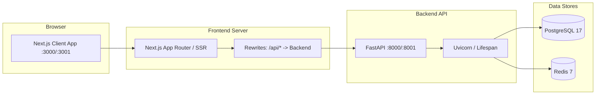
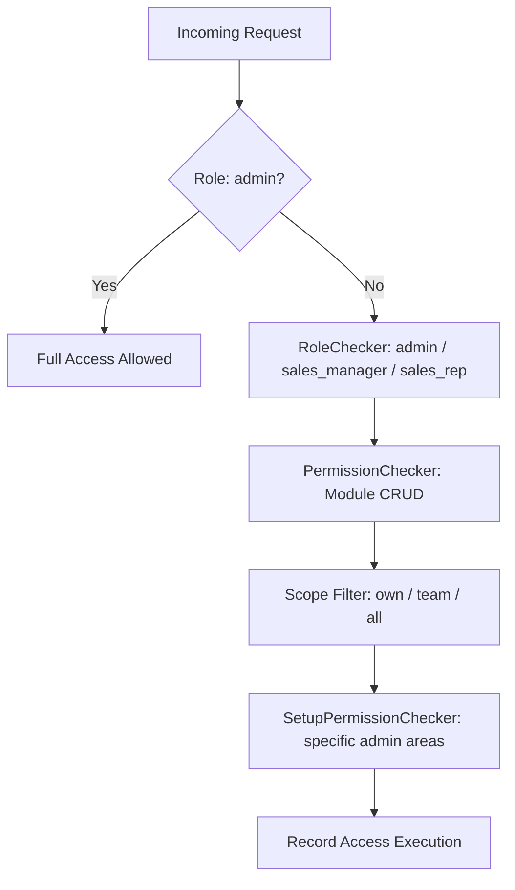
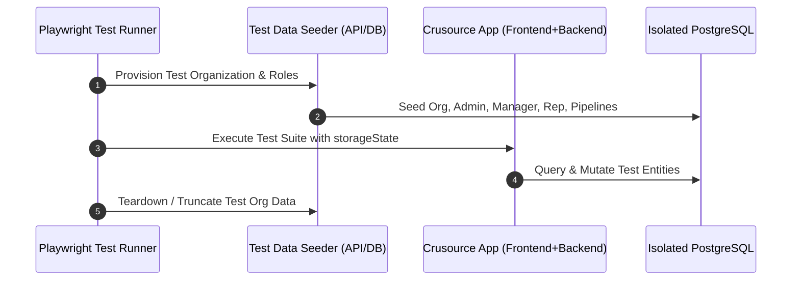
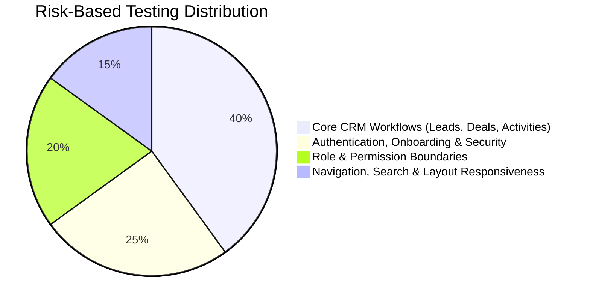
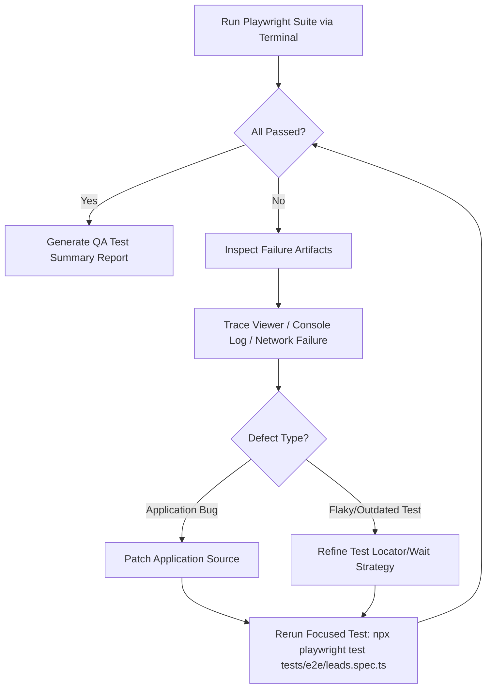

# Crusource CRM — Playwright Testing Discovery & Readiness Audit

**Document:** Playwright Automated Testing Discovery & Architecture Readiness Report  
**Target Application:** Crusource CRM (Multi-tenant Next.js 16 + FastAPI + PostgreSQL / Redis)  
**Date:** October 2026  
**Status:** Discovery Complete & Implementation Plan Defined  

---

## Executive Summary

Crusource CRM has substantial existing browser-level testing logic, but it is currently fragmented across two distinct paradigms:
1. **Isolated Component/Integration Browser Fixtures:** 13+ standalone `.mjs` scripts running via `esbuild` + Playwright Core in CI that mount individual React trees against in-memory Node HTTP mocks.
2. **Unconfigured End-to-End Tests:** A handful of full-journey `.spec.ts` / `.ts` scripts in `tests/e2e/` that are excluded from TypeScript compilation (`tsconfig.json`) and lack a formal `@playwright/test` runner configuration (`playwright.config.ts`).

To achieve reliable, unattended, end-to-end browser automation without flake or cross-environment contamination, Crusource CRM requires a standardized `@playwright/test` test harness, an automated environment lifecycle (Dockerized PostgreSQL/Redis or test-seeded backend), persistent session storage states (`storageState.json`), and structured reporting (HTML, JUnit, traces, failure screenshots, and console logs).

---

## 1. Existing Testing Setup & Reusable Assets

### 1.1 Existing Frameworks and Test Tooling

| Repository Area | Existing Tooling | Current Role | Reusability / Gap |
|---|---|---|---|
| **Frontend Unit & Component** | Node `assert`, `tsx` | Executes TSX component render checks & formatting tests | High value for rapid regression; keep in unit suite. |
| **Frontend Browser Regressions** | Playwright Core (`1.62.1`), `esbuild`, `node:http` | Runs isolated component bundles against custom HTTP mocks in CI | Useful for isolated component UI verification, but does not exercise Next.js routing, SSR/RSC hydration, or real backend APIs. |
| **Frontend E2E Directory** (`tests/e2e/`) | Playwright Core, plain TS scripts (`onboarding.spec.ts`, `test_deals_interactive.ts`) | Ad-hoc scenario scripts | High reusability for test logic; currently missing `@playwright/test` runner, fixtures, and CI wiring. |
| **Backend Unit & API** | `pytest`, SQLite in-memory, fake Redis | Fast business logic & handler unit tests | Used for backend CI unit stage. |
| **Backend DB Regressions** | `pytest`, PostgreSQL 17 test container, `alembic` | Migration drift, table locking, and PostgreSQL-specific queries | Demonstrates how disposable PostgreSQL instances can be spun up for backend integration. |

### 1.2 Reusable Assets
- **Form Selectors & Data-Test Attributes:** Existing browser scripts and E2E specs already establish robust locator patterns (`getByRole`, placeholder selectors, semantic form fields).
- **Mock Handlers & Test Payloads:** Mock routes in `test_*_browser.mjs` provide concrete reference payloads for leads, deals, pipelines, teams, and superadmin requests.
- **CI Pinned Playwright Version:** Frontend CI already includes `npx playwright install --with-deps chromium`, verifying that Chromium dependencies are available in CI runners.

---

## 2. Application Architecture & Communication Flow

### 2.1 Entry Points and Startup

1. **Frontend:** Next.js 16.3 (React 19, Tailwind 4).
   - Dev entry: `npm run dev` (port 3000).
   - Docker dev entry: port 3001 mapped to container 3000.
   - API Proxy / Rewrites: `next.config.ts` rewrites `/api/:path*` and `/public/:path*` to `INTERNAL_BACKEND_URL` / `NEXT_PUBLIC_API_URL` (`http://127.0.0.1:8000` or `http://backend:8000`).
2. **Backend:** FastAPI (Python 3.12, SQLAlchemy 2, Alembic).
   - Entry point: `src/main.py`.
   - Router mounting: Explicitly mounts 30+ routers with `/api/v1` prefixes.
   - Dev entry: Uvicorn on port 8000 (native) or port 8001 (full Docker stack).
3. **Authentication & Session Lifecycle:**
   - **Mechanism:** JWT (Access Token in `localStorage` or `Authorization: Bearer <token>`, Refresh Token in `localStorage` via `/api/v1/auth/refresh`).
   - **Client Transport:** `src/lib/api.ts` provides `fetchWithAuth`, handling automatic mutexed refresh, proactive expiry detection, and `X-Request-ID` correlation.
   - **Superadmin / Platform Auth:** Uses secure HttpOnly cookies (`crusource_platform`) and CSRF tokens (`X-Platform-CSRF`) isolated from tenant sessions.

---

## 3. Business Functionality & Feature Inventory

Based on [CRUSOURCE_CRM_MODULES_AND_FEATURES.md](file:///d:/GitHub/Crusource-CRM/crusource-crm-docs/CRUSOURCE_CRM_MODULES_AND_FEATURES.md) and current codebase inspection:

### 3.1 Fully Implemented Modules (Primary E2E Candidates)

| Module | Key Routes | Core User Workflows to Test |
|---|---|---|
| **Authentication & Onboarding** | `/login`, `/register`, `/verify-email`, `/onboarding`, `/forgot-password`, `/reset-password` | Account creation, OTP email verification, workspace identity slug validation & collisions, multi-step onboarding wizard, session persistence. |
| **Leads** | `/dashboard/leads` | Lead creation, list view vs. Kanban view, stage changes, qualification, lead conversion to Deal + Account + Contact. |
| **Contacts & Accounts** | `/dashboard/contacts`, `/dashboard/accounts` | Directory CRUD, account-contact association, activities timeline, bulk operations. |
| **Deals & Pipelines** | `/dashboard/deals`, `/dashboard/pipelines` | Opportunity creation, pipeline selector, drag-and-drop Kanban stage transitions, win/loss marking, deal requirements validation. |
| **Activities (Tasks, Calls, Meetings)** | `/dashboard/tasks`, `/dashboard/calls`, `/dashboard/meetings`, `/dashboard/calendar` | Task scheduling & completion, call logs with dispositions, meeting agendas & action items, FullCalendar rendering. |
| **Documents & Templates** | `/dashboard/documents`, `/dashboard/admin/templates` | Document upload, template creation, public sharing token verification (`/shared/document/[token]`). |
| **Campaigns & Outreach** | `/dashboard/campaigns` | Campaign builder, recipient audience filtering, template insertion, status transitions. |
| **Global Search & Notifications** | Global Header / Modal | Cross-entity keyword search, entity type filtering, notification read/unread badges. |
| **Team Space & Access Requests** | `/dashboard/teamspace`, `/dashboard/teamspace/requests`, `/dashboard/teamspace/pool` | Lead pool claiming, record access requests, reassignment requests, manager approval/rejection. |
| **Platform Superadmin** | `/superadmin/login`, `/superadmin/request-access`, `/superadmin/access` | Platform operator MFA login, access request submission, owner approval/revocation. |

### 3.2 Partially Implemented / Stubbed Modules (Exclude or Scope Carefully)

- **Reports & Analytics Boards:** Custom report builder and dashboard widgets render mock/static charts; deep formula creation is partial.
- **Data Import / Export / Backup:** Backend supports standard CSV imports for leads/deals; UI backup/storage tabs are partial.
- **Integrations (Zoho / Google Ads):** External OAuth dependencies require mock servers; live external calls must not run in automated E2E.
- **Customer Portal / All Buddy:** Planned / documented only.

---

## 4. Roles and Access Control Model

Crusource CRM enforces a dual-layer security model:

### 4.1 Supported Roles & Scopes
1. **Roles (`UserRole`):** `admin`, `sales_manager`, `sales_rep`.
2. **Record Visibility Scopes (`can_view`):**
   - `all`: Sees all organization records.
   - `team`: Sees records owned by members of the user's teams.
   - `own`: Sees only records owned by the user.
   - `none`: Module hidden/denied.
3. **Granular Action Capabilities:** `can_create`, `can_edit`, `can_delete`, `can_export`, `can_import`, `can_bulk_edit`.
4. **Setup Permissions:** Gated admin areas (`audit_logs`, `manage_users`, `manage_org`, `template_studio_create`, etc.).

### 4.2 Critical E2E Permission Scenarios to Test
- **Admin vs Rep Isolation:** Ensure `sales_rep` with `own` visibility cannot view or edit records owned by peers.
- **Team Lead Escalation:** Ensure a team lead can view and claim records within their team pool.
- **Sidebar & Route Gating:** Verify that navigating directly to restricted URLs (e.g. `/dashboard/admin/users`) redirects or shows permission denied for non-admin roles.
- **Destructive Action Protection:** Confirm that the Delete button is disabled or hidden for roles lacking `can_delete`.

---

## 5. Test Environment and Data Strategy

### 5.1 Environment Isolation & Safety

> [!CAUTION]
> E2E tests must never execute against the shared stage database (`crm-stage.crusource.com`) or production environments. Tests must run exclusively against local or dedicated ephemeral test containers.

### 5.2 Test Data Architecture

1. **Pre-test Seeding (API or DB Level):**
   - Provide a deterministic database seed script (`scripts/seed_test_e2e.py` or dedicated API fixture) that creates:
     - An isolated test organization (`org_e2e_test_<uuid>`).
     - Standard user accounts: `admin@e2e.test`, `manager@e2e.test`, `rep@e2e.test`.
     - Standard pipeline & stage configuration.
2. **Teardown Strategy:**
   - Delete test tenant data by `organization_id` at the conclusion of test runs.
   - Support database reset via Alembic rollbacks or Postgres container recreation during local runs.

---

## 6. Automation Readiness & Test Execution

### 6.1 Unattended CLI Execution
- Standard Playwright Test runner package `@playwright/test` should be added to `devDependencies`.
- Configuration (`playwright.config.ts`) will orchestrate:
  - Base URL configuration (`http://localhost:3000`).
  - Automatic web server startup (`npm run dev` and `uvicorn main:app` or Docker compose health checks).
  - Multi-browser projects (Chromium, Firefox, WebKit, Mobile Viewports).

### 6.2 Authentication Reusability (`storageState`)
- Rather than logging in via the UI before every single test (which adds 3–5 seconds per test), use Playwright's **`globalSetup`** or **Project Dependencies** to perform authentication once per role:
  - `playwright/.auth/admin.json`
  - `playwright/.auth/manager.json`
  - `playwright/.auth/rep.json`
- Tests inject the appropriate `storageState` instantly, reserving full UI login flows for dedicated authentication test suites.

### 6.3 Artifact & Failure Diagnostics
- **Screenshots:** Captured on failure (`screenshot: 'only-on-failure'`).
- **Traces:** Saved on retry/failure (`trace: 'retain-on-failure'`). Traces allow step-by-step DOM inspection, network waterfall analysis, and console inspection in the Playwright Trace Viewer.
- **Video:** Recorded on failure (`video: 'retain-on-failure'`).
- **Console & Network Telemetry:** Automatically assert zero uncaught browser console exceptions (`pageerror`) and failed internal API calls (500 status codes).

---

## 7. MCP and Browser Tooling Assessment

### 7.1 Available MCP Tooling Analysis

| Tooling Source | Available Capabilities | Assessment & Readiness |
|---|---|---|
| **Playwright MCP** (Lazy MCP Server) | `browser_navigate`, `browser_click`, `browser_type`, `browser_snapshot`, `browser_take_screenshot` | Ready for agent-driven interactive inspection and exploratory debugging in chat sessions. |
| **Chrome DevTools MCP** (Lazy MCP Server) | `evaluate_script`, `take_heapsnapshot`, `list_network_requests`, `performance_analyze` | Ready for deep network analysis and performance auditing. |
| **Browser Subagent** (Native Tool) | Autonomous multi-step browser task execution with recording output | Ready for exploratory workflow validation. |
| **Workspace Playwright CLI** | Pinned `playwright: 1.62.1` in `package.json` | Missing `@playwright/test` runner and `playwright.config.ts`. Once added, Antigravity can execute `npx playwright test` directly in the terminal. |

---

## 8. Risk-Based Testing Scope & Plan

### 8.1 Critical Workflow Test Suites

#### Suite 1: Authentication, Onboarding & Recovery
- User registration $\rightarrow$ OTP verification $\rightarrow$ workspace identity slug collision handling $\rightarrow$ company profile setup $\rightarrow$ dashboard entry.
- Password recovery request $\rightarrow$ token verification $\rightarrow$ reset password flow.
- Token refresh & automatic session preservation during page reload.

#### Suite 2: Leads & Qualification
- Create Lead with complete metadata $\rightarrow$ verify list view & table sorting.
- Toggle to Kanban view $\rightarrow$ drag lead between stages.
- Convert lead $\rightarrow$ assert modal options $\rightarrow$ verify simultaneous creation of Deal, Account, and Contact.

#### Suite 3: Deals & Pipelines
- Deal creation across custom stages $\rightarrow$ update deal value, expected close date, and win probability.
- Stage transition validations (e.g. mandatory loss reason or stage requirements).
- Mark deal as Won / Lost $\rightarrow$ verify forecast and dashboard metrics update.

#### Suite 4: Multi-Role Authorization & Scope Isolation
- Log in as `sales_rep` $\rightarrow$ verify only assigned/team records are visible.
- Attempt unauthorized direct API/route access $\rightarrow$ assert 403 Forbidden alert or redirect.
- Log in as `sales_manager` $\rightarrow$ approve lead reassignment / team space pool request.

#### Suite 5: Activities & Global Utilities
- Create Task, Call log, and Meeting $\rightarrow$ verify calendar synchronization.
- Open Global Search modal $\rightarrow$ search across multi-module records $\rightarrow$ navigate to result.
- Open Global Notes scratchpad $\rightarrow$ write note $\rightarrow$ verify autosave.

---

## 9. Test Execution, Investigation & Triage Workflow

### 9.1 Antigravity Automated Run & Fix Loop

1. **Execution:** Antigravity runs `npx playwright test` via `run_command`.
2. **Triage:** If a test fails:
   - Read the failure output and open the trace file.
   - Distinguish whether the failure is an **Application Defect** (e.g. 500 API response, broken mutation) or a **Test Harness Issue** (e.g. race condition, brittle selector).
3. **Fix & Verify:** Apply the minimal required fix in the application or test and rerun the isolated test file.

---

## 10. Concrete Gaps, Risks & Next Steps

### 10.1 Identified Technical Gaps
1. **Missing `@playwright/test` Package:** `crusource-crm-frontend/package.json` contains `playwright` (core), but not `@playwright/test` (runner).
2. **No `playwright.config.ts`:** No central configuration for timeouts, base URLs, reporters, or projects.
3. **Excluded `tests/e2e` in `tsconfig.json`:** TypeScript ignores E2E files; a dedicated `tsconfig` or inclusion is needed.
4. **Environment Bootstrapping in CI:** CI runs unit browser scripts via `browserFixture.mjs` against mocked HTTP servers. A full E2E run in CI will require running the Next.js frontend + FastAPI backend against Postgres.

### 10.2 Recommended Implementation Roadmap

| Phase | Milestone | Deliverables |
|---|---|---|
| **Phase 1: Test Foundation** | Setup Runner & Config | Install `@playwright/test`, add `playwright.config.ts`, configure global setup, artifact directories (`test-results/`), and reporters. |
| **Phase 2: Authentication & StorageState** | Session Management | Implement global authentication setup for `admin`, `manager`, `rep` generating reusable `storageState.json`. |
| **Phase 3: Core E2E Suites** | High-Priority Workflows | Migrate & implement Onboarding, Leads Lifecycle, Deals Kanban, and Permission Isolation suites. |
| **Phase 4: CI Integration** | Automated Pipeline | Add an E2E step to `.github/workflows/ci.yml` with service containers and trace artifact uploads on failure. |

---
