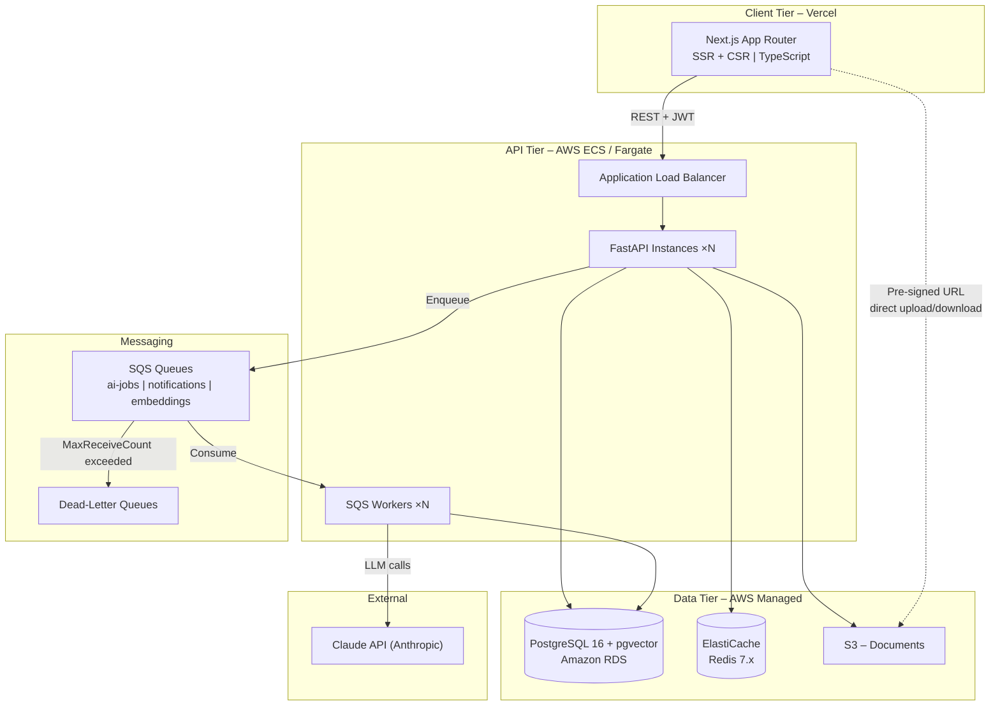
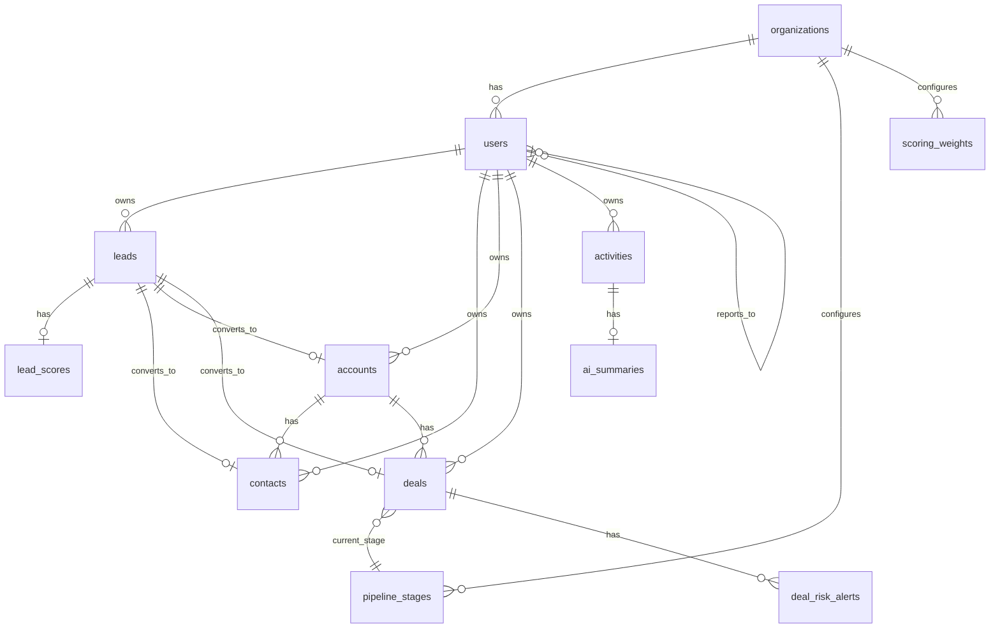
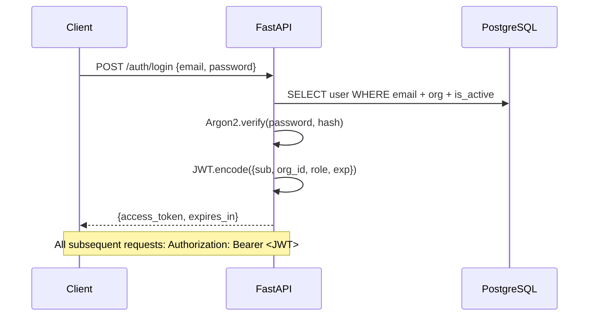
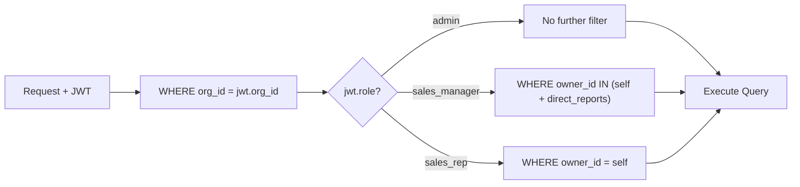
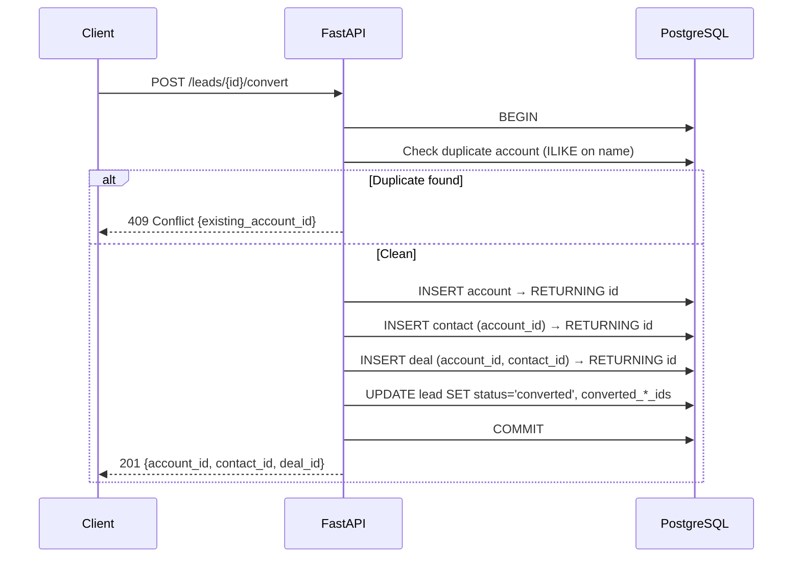
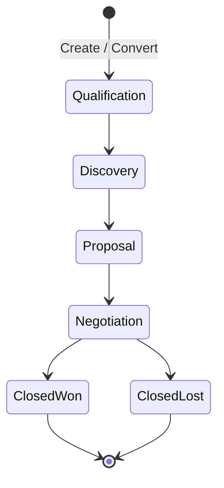
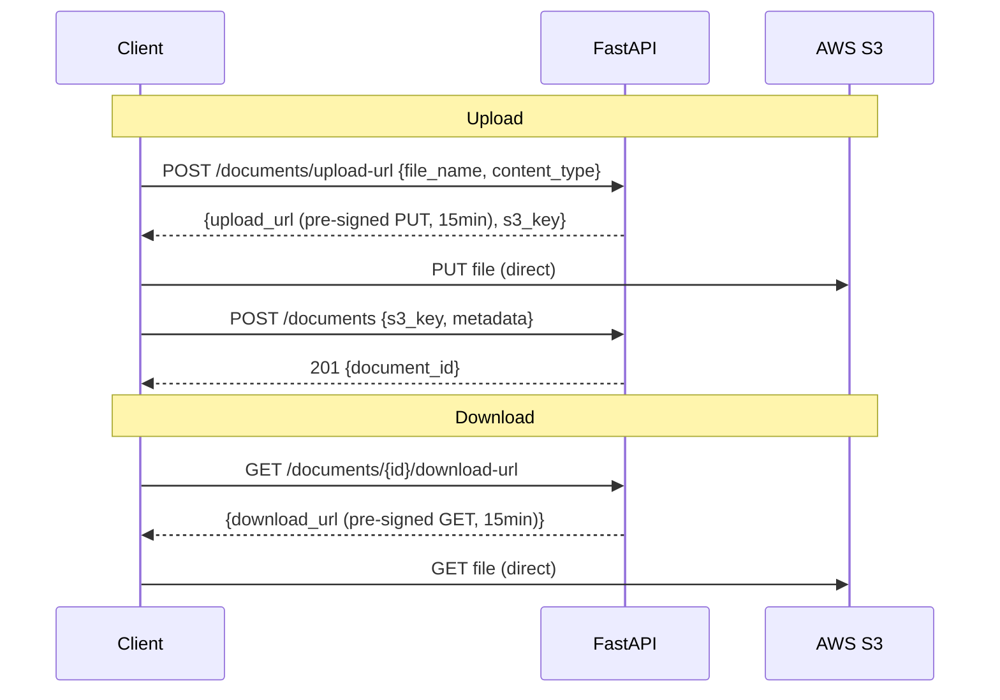
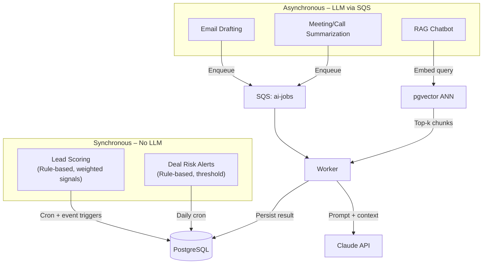

---

## Table of Contents

1. [System Architecture](#1-system-architecture)
2. [Technology Stack](#2-technology-stack)
3. [Database Schema](#3-database-schema)
4. [API Design](#4-api-design)
5. [Authentication & Authorization](#5-authentication--authorization)
6. [Module Data Flows](#6-module-data-flows)
7. [AI Subsystem](#7-ai-subsystem)
8. [Caching Strategy](#8-caching-strategy)
9. [File Storage (S3)](#9-file-storage-s3)
10. [Background Job Processing](#10-background-job-processing)
11. [Search & Notifications](#11-search--notifications)
12. [Security](#12-security)
13. [Scalability & Performance](#13-scalability--performance)
14. [Observability](#14-observability)
15. [Error Handling](#15-error-handling)
16. [Appendix — ADRs](#16-appendix--adrs)

---

## 1. System Architecture

Three-tier architecture with an async AI processing layer.

### Core Principles

| Principle | How |
|---|---|
| API-first | All client ↔ server via REST |
| Stateless backend | JWT auth, no server-side sessions |
| Async AI | LLM calls offloaded to SQS workers, never blocking requests |
| Cache-first dashboards | ElastiCache with TTL-based refresh |
| Pre-signed uploads | Files go direct to S3, never through the API |
| Row-level security | Every query filtered by role-based scope at ORM layer |

---

## 2. Technology Stack

### Frontend

| Layer | Technology | Purpose |
|---|---|---|
| Framework | Next.js 14+ (App Router) + TypeScript | SSR, file-based routing |
| UI | Tailwind CSS + shadcn/ui | Styling + accessible components |
| Server State | TanStack Query 5 | Caching, refetching, optimistic updates |
| Client State | Redux Toolkit 2 | Complex cross-component state |
| Tables | TanStack Table 8 | Headless sortable/filterable tables |
| Drag & Drop | dnd-kit 6 | Kanban board interactions |
| Forms | React Hook Form 7 + Zod 3 | Form management + schema validation |
| Charts | Recharts 2 | Dashboard visualizations |

### Backend

| Layer | Technology | Purpose |
|---|---|---|
| Framework | FastAPI 0.110+ | Async HTTP, auto-generated OpenAPI |
| Language | Python 3.12+ | AI/ML ecosystem |
| ORM | SQLAlchemy 2 (async) | Query building, model mapping |
| Migrations | Alembic 1.13+ | Schema versioning |
| Auth | python-jose (HS256 JWT) + Passlib (Argon2id) | Token auth + password hashing |
| Validation | Pydantic 2 | Request/response validation |
| HTTP Client | httpx 0.27+ | Async calls to Claude API |

### Infrastructure

| Layer | Technology | Purpose |
|---|---|---|
| Frontend Hosting | Vercel | Zero-config Next.js deployment |
| Backend Hosting | AWS ECS / Fargate | Serverless containers |
| Database | Amazon RDS PostgreSQL 16 + pgvector | Relational storage + vector search |
| Cache | AWS ElastiCache (Redis 7.x) | Dashboard cache, rate limiting |
| Object Storage | AWS S3 | Document binaries |
| Message Queue | AWS SQS (Standard) | Async job dispatch |
| Secrets | AWS Secrets Manager | Credentials, JWT secret |
| CI/CD | GitHub Actions | Build → test → deploy |
| Monitoring | AWS CloudWatch | Logs, metrics, alarms |

---

## 3. Database Schema

### ER Diagram

### Table Definitions

#### `organizations`

| Column | Type | Constraints |
|---|---|---|
| `id` | `UUID` | PK |
| `name` | `VARCHAR(255)` | NOT NULL |
| `trial_expires_at` | `TIMESTAMPTZ` | NOT NULL |
| `subscription_status` | `VARCHAR(20)` | NOT NULL, DEFAULT `'trial'` — `trial / active / expired / cancelled` |
| `created_at` | `TIMESTAMPTZ` | NOT NULL, DEFAULT `now()` |
| `updated_at` | `TIMESTAMPTZ` | NOT NULL, DEFAULT `now()` |

---

#### `users`

| Column | Type | Constraints |
|---|---|---|
| `id` | `UUID` | PK |
| `org_id` | `UUID` | FK → organizations, NOT NULL |
| `email` | `VARCHAR(255)` | NOT NULL |
| `password_hash` | `VARCHAR(255)` | NOT NULL (Argon2id) |
| `first_name` | `VARCHAR(100)` | NOT NULL |
| `last_name` | `VARCHAR(100)` | NOT NULL |
| `role` | `VARCHAR(20)` | NOT NULL — `admin / sales_manager / sales_rep` |
| `reports_to` | `UUID` | FK → users, NULLABLE |
| `is_active` | `BOOLEAN` | NOT NULL, DEFAULT `true` |
| `created_at / updated_at` | `TIMESTAMPTZ` | NOT NULL |

**Indexes:** `UNIQUE(org_id, email)`, `IX(org_id, role)`, `IX(reports_to)`

---

#### `leads`

| Column | Type | Constraints |
|---|---|---|
| `id` | `UUID` | PK |
| `org_id` | `UUID` | FK → organizations, NOT NULL |
| `owner_id` | `UUID` | FK → users, NOT NULL |
| `first_name / last_name` | `VARCHAR(100)` | NOT NULL |
| `company` | `VARCHAR(255)` | NULLABLE |
| `email` | `VARCHAR(255)` | NULLABLE |
| `phone` | `VARCHAR(50)` | NULLABLE |
| `source` | `VARCHAR(50)` | NULLABLE — `cold_email / referral / website / trade_show` |
| `status` | `VARCHAR(20)` | NOT NULL, DEFAULT `'new'` — `new / qualified / converted / junk` |
| `converted_at` | `TIMESTAMPTZ` | NULLABLE |
| `converted_contact_id` | `UUID` | FK → contacts, NULLABLE |
| `converted_account_id` | `UUID` | FK → accounts, NULLABLE |
| `converted_deal_id` | `UUID` | FK → deals, NULLABLE |
| `created_at / updated_at` | `TIMESTAMPTZ` | NOT NULL |

**Indexes:** `IX(org_id, owner_id)`, `IX(org_id, status)`, `IX(org_id, created_at DESC)`

---

#### `accounts`

| Column | Type | Constraints |
|---|---|---|
| `id` | `UUID` | PK |
| `org_id` | `UUID` | FK → organizations, NOT NULL |
| `owner_id` | `UUID` | FK → users, NOT NULL |
| `name` | `VARCHAR(255)` | NOT NULL |
| `phone` | `VARCHAR(50)` | NULLABLE |
| `website` | `VARCHAR(255)` | NULLABLE |
| `created_at / updated_at` | `TIMESTAMPTZ` | NOT NULL |

**Indexes:** `IX(org_id, owner_id)`, `IX(org_id, name)` ← duplicate detection

---

#### `contacts`

| Column | Type | Constraints |
|---|---|---|
| `id` | `UUID` | PK |
| `org_id` | `UUID` | FK → organizations, NOT NULL |
| `owner_id` | `UUID` | FK → users, NOT NULL |
| `account_id` | `UUID` | FK → accounts, NOT NULL |
| `first_name / last_name` | `VARCHAR(100)` | NOT NULL |
| `email` | `VARCHAR(255)` | NULLABLE |
| `phone` | `VARCHAR(50)` | NULLABLE |
| `created_at / updated_at` | `TIMESTAMPTZ` | NOT NULL |

**Indexes:** `IX(org_id, owner_id)`, `IX(account_id)`

---

#### `pipeline_stages`

| Column | Type | Constraints |
|---|---|---|
| `id` | `UUID` | PK |
| `org_id` | `UUID` | FK → organizations, NOT NULL |
| `name` | `VARCHAR(100)` | NOT NULL |
| `display_order` | `INTEGER` | NOT NULL |
| `win_probability` | `DECIMAL(5,2)` | NOT NULL (0.00–100.00) |
| `is_closed` | `BOOLEAN` | NOT NULL, DEFAULT `false` |
| `is_won` | `BOOLEAN` | NOT NULL, DEFAULT `false` |

**Default seed:** Qualification (10%) → Discovery (25%) → Proposal (50%) → Negotiation (75%) → Closed Won (100%) → Closed Lost (0%)

**Indexes:** `UNIQUE(org_id, display_order)`

---

#### `deals`

| Column | Type | Constraints |
|---|---|---|
| `id` | `UUID` | PK |
| `org_id` | `UUID` | FK → organizations, NOT NULL |
| `owner_id` | `UUID` | FK → users, NOT NULL |
| `account_id` | `UUID` | FK → accounts, NOT NULL |
| `contact_id` | `UUID` | FK → contacts, NULLABLE |
| `name` | `VARCHAR(255)` | NOT NULL |
| `amount` | `DECIMAL(15,2)` | NOT NULL, DEFAULT `0` |
| `stage_id` | `UUID` | FK → pipeline_stages, NOT NULL |
| `expected_close_date` | `DATE` | NULLABLE |
| `next_followup_date` | `DATE` | NULLABLE |
| `last_interaction_at` | `TIMESTAMPTZ` | NULLABLE |
| `created_at / updated_at` | `TIMESTAMPTZ` | NOT NULL |

**Indexes:** `IX(org_id, owner_id)`, `IX(org_id, stage_id)`, `IX(org_id, expected_close_date)`, `IX(account_id)`

---

#### `activities` (Single-Table Inheritance)

Base columns for all activity types (`task / meeting / call / note`):

| Column | Type | Constraints |
|---|---|---|
| `id` | `UUID` | PK |
| `org_id` | `UUID` | FK → organizations, NOT NULL |
| `owner_id` | `UUID` | FK → users, NOT NULL |
| `activity_type` | `VARCHAR(20)` | NOT NULL — discriminator |
| `related_to_type` | `VARCHAR(20)` | NOT NULL — `lead / contact / account / deal` |
| `related_to_id` | `UUID` | NOT NULL |
| `created_at / updated_at` | `TIMESTAMPTZ` | NOT NULL |

Type-specific columns (nullable, used per type):

| Column | Type | Used By |
|---|---|---|
| `subject` | `VARCHAR(255)` | task |
| `due_date` | `DATE` | task |
| `task_status` | `VARCHAR(20)` | task — `not_started / in_progress / completed` |
| `priority` | `VARCHAR(20)` | task — `low / normal / high / highest` |
| `title` | `VARCHAR(255)` | meeting |
| `start_time / end_time` | `TIMESTAMPTZ` | meeting, call |
| `host_id` | `UUID` | meeting |
| `direction` | `VARCHAR(10)` | call — `inbound / outbound` |
| `duration_seconds` | `INTEGER` | call |
| `body` | `TEXT` | note |
| `transcript` | `TEXT` | meeting, call — for AI summarization |

**Indexes:** `IX(org_id, owner_id)`, `IX(org_id, related_to_type, related_to_id)`, `IX(due_date)`

> [!NOTE]
> STI chosen over separate tables to enable the Activity Timeline with a single query instead of `UNION ALL` across four tables.

---

#### `documents`

| Column | Type | Constraints |
|---|---|---|
| `id` | `UUID` | PK |
| `org_id / owner_id` | `UUID` | FK, NOT NULL |
| `file_name` | `VARCHAR(255)` | NOT NULL |
| `file_size_bytes` | `BIGINT` | NOT NULL |
| `content_type` | `VARCHAR(100)` | NOT NULL (MIME) |
| `s3_key` | `VARCHAR(512)` | NOT NULL, UNIQUE |
| `related_to_type` | `VARCHAR(20)` | NOT NULL — `account / deal` |
| `related_to_id` | `UUID` | NOT NULL |
| `uploaded_at` | `TIMESTAMPTZ` | NOT NULL |

---

#### AI & Support Tables

| Table | Key Columns | Purpose |
|---|---|---|
| `lead_scores` | `lead_id` (UNIQUE), `score` (0–100), `reason` (TEXT), `scored_at` | Rule-based lead scoring results |
| `scoring_weights` | `org_id` + `signal_name` (UNIQUE), `weight` (DECIMAL) | Admin-tunable scoring weights per org |
| `deal_risk_alerts` | `deal_id`, `risk_type`, `reason`, `is_dismissed`, `dismissed_by` | Stale/at-risk deal flags |
| `ai_summaries` | `activity_id` (UNIQUE), `summary_text`, `suggested_next_step`, `follow_up_task_id`, `model_id` | Meeting/call AI summaries |
| `ai_email_drafts` | `user_id`, `related_to_type/id`, `subject`, `body`, `model_id` | Generated email drafts |
| `chat_messages` | `user_id`, `session_id`, `role` (user/assistant), `content`, `source_record_ids` (UUID[]) | RAG chatbot conversation history |
| `document_embeddings` | `source_type/id`, `chunk_index`, `content_text`, `embedding` (VECTOR(1536)) | pgvector embeddings for RAG |
| `notifications` | `user_id`, `type`, `title`, `related_to_type/id`, `is_read` | In-app notifications |

**pgvector index:** `IVFFLAT(embedding vector_cosine_ops) WITH (lists = 100)` on `document_embeddings`

---

## 4. API Design

### Conventions

| Aspect | Convention |
|---|---|
| Base URL | `https://api.crusource.com/v1` |
| Auth | `Authorization: Bearer <JWT>` |
| Pagination | Cursor-based: `?cursor=<uuid>&limit=50` |
| Filtering | Query params: `?status=new&source=referral` |
| Sorting | `?sort_by=created_at&sort_order=desc` |
| Error format | `{ "error": { "code", "message", "details", "request_id" } }` |

### Endpoint Catalog

#### Auth & Users (Admin-only for user mgmt)

| Method | Path | Description |
|---|---|---|
| `POST` | `/auth/login` | Login → JWT |
| `POST` | `/auth/refresh` | Refresh JWT |
| `GET/POST/PATCH` | `/users`, `/users/{id}` | User CRUD (Admin) |
| `POST` | `/users/{id}/deactivate` | Deactivate (preserves records) |
| `POST` | `/users/{id}/transfer` | Transfer all records |

#### Leads

| Method | Path | Description |
|---|---|---|
| `GET/POST` | `/leads` | List (scoped) / Create |
| `GET/PATCH/DELETE` | `/leads/{id}` | Read / Update / Delete |
| `POST` | `/leads/import` | CSV bulk import |
| `POST` | `/leads/{id}/convert` | Convert → Account + Contact + Deal (atomic) |
| `GET` | `/leads/{id}/score` | AI lead score |
| `GET` | `/leads/kanban` | Grouped by status |

#### Contacts

| Method | Path | Description |
|---|---|---|
| `GET/POST` | `/contacts` | List / Create |
| `GET/PATCH/DELETE` | `/contacts/{id}` | CRUD |
| `POST` | `/contacts/import` | CSV import |
| `GET` | `/contacts/{id}/summary` | AI conversation summary |

#### Accounts

| Method | Path | Description |
|---|---|---|
| `GET/POST` | `/accounts` | List / Create (triggers duplicate check) |
| `GET/PATCH/DELETE` | `/accounts/{id}` | CRUD |
| `POST` | `/accounts/import` | CSV import |
| `GET` | `/accounts/{id}/contacts` | Contacts tab |
| `GET` | `/accounts/{id}/deals` | Deals tab |
| `GET` | `/accounts/{id}/activities` | Activities tab |
| `GET` | `/accounts/duplicates` | Duplicate name check |

#### Deals

| Method | Path | Description |
|---|---|---|
| `GET/POST` | `/deals` | List / Create |
| `GET/PATCH/DELETE` | `/deals/{id}` | CRUD (PATCH includes stage change) |
| `POST` | `/deals/import` | CSV import |
| `GET` | `/deals/kanban` | Grouped by stage with column totals |
| `GET` | `/deals/{id}/risk-alerts` | Risk alerts for deal |
| `POST` | `/deals/{id}/risk-alerts/{alert_id}/dismiss` | Dismiss alert |

#### Activities

| Method | Path | Description |
|---|---|---|
| `GET/POST` | `/activities` | List (filterable by type) / Create |
| `GET/PATCH/DELETE` | `/activities/{id}` | CRUD |
| `POST` | `/activities/import` | CSV import (tasks) |
| `GET` | `/activities/timeline/{entity_type}/{entity_id}` | Unified timeline |

#### Documents

| Method | Path | Description |
|---|---|---|
| `GET` | `/documents` | List (scoped) |
| `POST` | `/documents/upload-url` | Get pre-signed upload URL |
| `POST` | `/documents` | Register metadata after upload |
| `GET` | `/documents/{id}/download-url` | Get pre-signed download URL |
| `DELETE` | `/documents/{id}` | Delete (metadata + S3 object) |

#### Dashboards & Reports

| Method | Path | Description |
|---|---|---|
| `GET` | `/dashboard/home` | Home dashboard (role-scoped) |
| `GET` | `/dashboard/analytics` | Org-wide analytics |
| `GET` | `/reports` | List available reports |
| `GET` | `/reports/{slug}` | Execute pre-built report |

#### AI

| Method | Path | Description |
|---|---|---|
| `POST` | `/ai/email-draft` | Request email draft (async → SQS) → 202 |
| `GET` | `/ai/email-draft/{id}` | Get generated draft |
| `POST` | `/ai/summarize/{activity_id}` | Request meeting/call summary (async) |
| `GET` | `/ai/summary/{activity_id}` | Get summary |
| `POST` | `/ai/summary/{activity_id}/create-task` | One-click: next step → task |
| `POST` | `/ai/chat` | Send message to RAG chatbot |
| `GET` | `/ai/chat/sessions/{id}` | Get chat history |

#### Settings (Admin), Search & Notifications

| Method | Path | Description |
|---|---|---|
| `GET/PUT` | `/settings/pipeline-stages` | Read / bulk-replace stages |
| `GET/PUT` | `/settings/scoring-weights` | Read / update scoring weights |
| `GET` | `/search?q=<query>` | Global search (leads + contacts + accounts + deals) |
| `GET` | `/notifications` | List user notifications |
| `PATCH` | `/notifications/{id}/read` | Mark as read |

---

## 5. Authentication & Authorization

### JWT Structure

| Field | Value |
|---|---|
| `sub` | User UUID |
| `org_id` | Organization UUID (tenant isolation) |
| `role` | `admin / sales_manager / sales_rep` |
| `exp` | Expiry (24h default) |
| **Signing** | HS256, secret from AWS Secrets Manager |

### Auth Flow

### Row-Level Scope Filter

Applied at the ORM layer on **every** data query:

### Endpoint Permission Guards

| Endpoint Group | Allowed Roles |
|---|---|
| User management, settings | `admin` only |
| All data CRUD, AI features | `admin`, `sales_manager`, `sales_rep` (data scoped by role) |
| Login | Unauthenticated |

---

## 6. Module Data Flows

### 6.1 Lead Conversion (Atomic Transaction)

### 6.2 Deal Pipeline

**Stage update side effects:** update `last_interaction_at`, invalidate dashboard cache, clear stale-deal risk alerts.

### 6.3 Activity Timeline

- Single query on `activities` table (STI) filtered by `related_to_type + related_to_id`, LEFT JOIN `ai_summaries`, ordered by `created_at DESC`.
- Returns tasks, meetings, calls, notes with inline AI summaries in one response.

### 6.4 Document Upload/Download

> [!IMPORTANT]
> Binaries **never** pass through the API server. S3 key format: `{org_id}/{related_type}/{related_id}/{uuid}/{filename}`

---

## 7. AI Subsystem

### Architecture

### Feature Breakdown

| Feature | Type | Trigger | Processing |
|---|---|---|---|
| **Lead Scoring** | Rule-based (no LLM) | Overnight cron + instant on status/activity change | Weighted signal evaluation → 0–100 score + plain-language reason. Admin-tunable weights via `scoring_weights` table. |
| **Deal Risk Alerts** | Rule-based (no LLM) | Daily cron scan | Flags deals with no activity ≥7 days or close date ≤7 days without recent progress. Stored in `deal_risk_alerts`, dismissible. |
| **Email Drafts** | Generative (Claude) | User clicks "Draft with AI" | API enqueues to SQS → Worker fetches record + activity context → builds prompt → Claude → result stored in `ai_email_drafts`. Returns 202; client polls for result. |
| **Meeting/Call Summaries** | Generative (Claude) | After activity logged with transcript | SQS → Worker → Claude → summary + suggested next step stored in `ai_summaries`. One-click conversion of next step → follow-up task. |
| **RAG Chatbot** | Generative (Claude + pgvector) | User sends message | Embed query → ANN search in `document_embeddings` (scoped by `org_id` + user visibility) → top-k context chunks → Claude prompt → answer with `source_record_ids`. |

### Embedding Pipeline

- **Trigger:** Record create/update → enqueue embedding job to SQS (`embeddings` queue)
- **Worker:** Fetch record text → chunk (512 tokens) → embed → upsert into `document_embeddings`
- **Scope:** RAG queries filter embeddings by `org_id` + user's visible record IDs (same scope filter as direct queries)

### Guardrails

- AI **never acts autonomously** — scores, drafts, flags, summarizes only
- AI output inherits the same visibility scope as the underlying record
- Every chatbot answer includes source record links

---

## 8. Caching Strategy

**Layer:** ElastiCache (Redis 7.x). **Pattern:** Cache-aside with write-through invalidation.

| Cache Target | Key Pattern | TTL | Invalidation |
|---|---|---|---|
| Home Dashboard | `dash:home:{org_id}:{user_id}` | 5 min | Activity/deal/lead write |
| Analytics Dashboard | `dash:analytics:{org_id}` | 10 min | Deal/lead write |
| Kanban (Leads/Deals) | `kanban:{type}:{org_id}:{user_id}` | 2 min | Status/stage change |
| Pre-built Reports | `report:{slug}:{org_id}:{user_id}` | 15 min | Underlying data change |
| User's direct reports | `reports:{user_id}` | 30 min | Admin "Reports To" change |
| Rate limit counters | `ratelimit:{user_id}:{endpoint}` | 1 min sliding | — |

**Invalidation:** On any write operation, delete relevant cache keys for the affected `org_id` + `user_id`.

---

## 9. File Storage (S3)

| Setting | Value |
|---|---|
| Key format | `{org_id}/{related_type}/{related_id}/{uuid}/{filename}` |
| Pre-signed URL expiry | 15 minutes (both upload and download) |
| Max file size | 50 MB (enforced via S3 policy) |
| Encryption | SSE-S3 (AES-256) at rest |
| Versioning | Disabled (V1) |
| CORS | Allow PUT/GET from frontend domain only |
| Public access | Blocked — all access via pre-signed URLs |

---

## 10. Background Job Processing

### Queue Topology

| Queue | Purpose | Workers | DLQ |
|---|---|---|---|
| `ai-jobs` | Email drafts, summaries, batch scoring, risk scans | ECS Fargate tasks | `ai-jobs-dlq` |
| `notifications` | Notification generation & delivery | ECS Fargate tasks | `notifications-dlq` |
| `embeddings` | Vector embedding generation | ECS Fargate tasks | `embeddings-dlq` |

### Job Message Schema

`{ job_id, job_type, org_id, user_id, payload: { record_type, record_id, context }, enqueued_at }`

### Worker Config

| Setting | Value | Rationale |
|---|---|---|
| Long-poll wait | 20s | Reduce empty receives |
| Visibility timeout | 300s (5 min) | Buffer for LLM calls (10–30s) |
| Max receive count | 3 | 3 attempts before DLQ |
| DLQ retention | 14 days | Time for manual inspection/replay |

### Scaling

Workers auto-scale via ECS based on `ApproximateNumberOfMessagesVisible` > 10.

---

## 11. Search & Notifications

### Global Search

- `UNION ALL` query across `leads`, `contacts`, `accounts`, `deals` using `ILIKE` matching on name/email/company fields
- Scoped by `org_id` + user visibility, limited to top 20 results
- **Upgrade path:** Migrate to `tsvector` + GIN indexes if performance degrades

### Notifications

| Event | Notification Type | Recipient |
|---|---|---|
| Task assigned | `assignment` | Assigned user |
| Task due date reached | `task_due` | Task owner |
| Deal risk alert created | `deal_risk` | Deal owner |

**Delivery:** Client polls `GET /notifications` every 30s. WebSocket push is a post-V1 upgrade.

---

## 12. Security

| Threat | Mitigation |
|---|---|
| Credential theft | Argon2id hashing, short-lived JWT, secrets in Secrets Manager |
| SQL injection | SQLAlchemy parameterized queries — no raw string SQL |
| XSS | React auto-escaping + Content Security Policy headers |
| Broken access control | Row-level scope filter on every query + endpoint role guards |
| Tenant leakage | `org_id` filter at ORM layer on ALL queries |
| File upload attacks | Pre-signed URLs with content-type enforcement, 50 MB limit |
| Rate limiting | ElastiCache sliding-window per user+endpoint |
| Insecure deserialization | Pydantic strict validation on all request bodies |
| Client-side code execution | No `eval()`, hardened CSP |

**Rate limits:** Login: 10/min. AI endpoints: 20–30/5min. Default: 100/min.

**Security headers:** HSTS, X-Content-Type-Options: nosniff, X-Frame-Options: DENY, strict CSP, Referrer-Policy.

---

## 13. Scalability & Performance

### Scaling Strategy

| Component | Method | Trigger |
|---|---|---|
| API Server | ECS horizontal (task count) | CPU > 70% for 3 min |
| Workers | ECS horizontal (task count) | Queue depth > 10 |
| DB reads | Read replica routing | Report/dashboard queries |
| DB writes | Vertical (instance size) | Write throughput bottleneck |
| Cache | ElastiCache cluster sharding | Memory pressure |

### Performance Targets

| Metric | Target |
|---|---|
| API p50 / p95 / p99 | < 100ms / < 500ms / < 1s |
| Dashboard load (cache hit / miss) | < 2s / < 5s |
| Global search | < 500ms |
| AI email draft | < 30s (async) |
| AI chat response | < 10s |
| CSV import (1000 rows) | < 30s |

### Key Optimizations

- Cursor-based pagination (not OFFSET)
- SQLAlchemy `selectinload` / `joinedload` for N+1 prevention
- Kanban: single `GROUP BY stage_id` + `SUM(amount)` query
- Dashboard: cache-first with TTL invalidation
- Connection pooling: 30 connections/instance, PgBouncer if scaling beyond ~6 instances

---

## 14. Observability

### Logging

- **Backend:** `structlog` → CloudWatch Logs (JSON structured)
- **Frontend:** Vercel Log Drain
- **Every request logs:** `request_id`, `user_id`, `org_id`, `method`, `path`, `status`, `duration_ms`, `scope`
- **Never logged:** passwords, tokens, PII in query params

### Alarms

| Metric | Source | Threshold |
|---|---|---|
| 5xx error rate | ALB | > 1% for 5 min |
| API latency (p95) | ALB | > 1s for 5 min |
| ECS CPU | ECS | > 80% for 5 min |
| RDS connections | RDS | > 150 / 200 |
| SQS DLQ count | SQS | > 0 (immediate) |
| Cache hit rate | ElastiCache | < 80% |

### Health Check

`GET /health` → checks DB, cache, SQS connectivity → returns `{ status: "healthy" | "degraded", checks: {...} }`

---

## 15. Error Handling

### Response Format

`{ "error": { "code", "message", "details": [...], "request_id" } }`

### Error Codes

| Code | HTTP | When |
|---|---|---|
| `VALIDATION_ERROR` | 422 | Pydantic validation failure |
| `AUTHENTICATION_REQUIRED` | 401 | Missing / expired JWT |
| `FORBIDDEN` | 403 | Insufficient role |
| `NOT_FOUND` | 404 | Record missing or out of scope |
| `DUPLICATE_RESOURCE` | 409 | Duplicate account detected |
| `RATE_LIMITED` | 429 | Rate limit exceeded |
| `AI_GENERATION_FAILED` | 502 | Claude API failure |
| `INTERNAL_ERROR` | 500 | Unhandled exception |
| `SERVICE_UNAVAILABLE` | 503 | DB / cache / SQS down |

---

## 16. Appendix — ADRs

| # | Decision | Chosen | Alternative | Rationale |
|---|---|---|---|---|
| 001 | Frontend | Next.js (App Router) | React (Vite) | SSR, file routing, Vercel deploy |
| 002 | Backend | Python (FastAPI) | Node.js (NestJS) | AI/ML ecosystem maturity |
| 003 | Database | PostgreSQL + pgvector | MongoDB | Relational integrity + vector search in same DB |
| 004 | Activity storage | Single-table inheritance | Separate tables | Simplifies timeline query (no UNION ALL) |
| 005 | Activity linking | Polymorphic (type + id) | Multiple nullable FKs | Flexible, avoids N nullable columns |
| 006 | File storage | Pre-signed URL (S3 direct) | API proxy | Decouples file size from API memory |
| 007 | AI processing | Async (SQS workers) | Synchronous | LLM calls (10–30s) can't block requests |
| 008 | Cache | ElastiCache (managed) | Self-managed Redis | Reduced ops burden |
| 009 | Job queue | SQS | Celery + Redis | Serverless, no broker dependency |
| 010 | Lead scoring | Rule-based | LLM-based | Deterministic, fast, Admin-tunable, no AI cost |
| 011 | Deal risk alerts | Rule-based | LLM-based | Simple thresholds sufficient |
| 012 | Vector store | pgvector | Pinecone / Weaviate | No extra infra; fine for V1 scale |
| 013 | Auth | JWT (stateless) | Sessions | Horizontal scalability |
| 014 | Search | ILIKE | Elasticsearch | Sufficient for V1; avoids extra infra |
| 015 | Notifications | HTTP polling | WebSockets | Simpler for V1; WebSockets post-V1 |

---

> **Document Status:** Draft — July 2026
