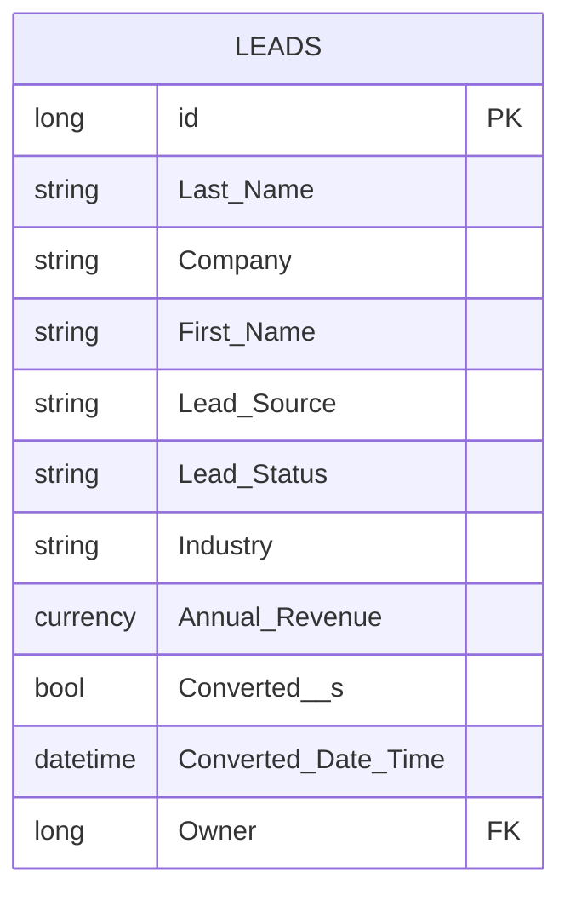
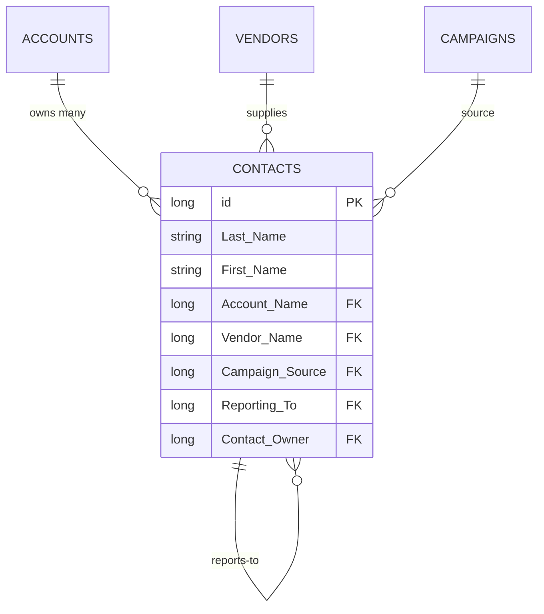
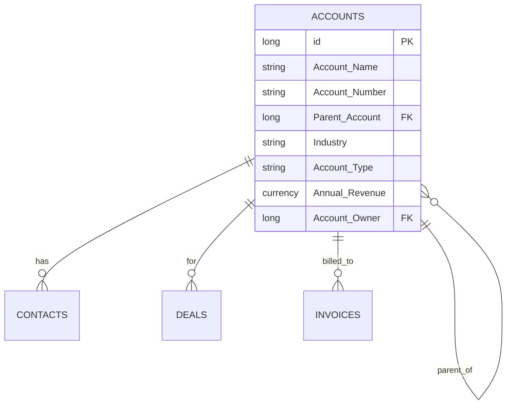
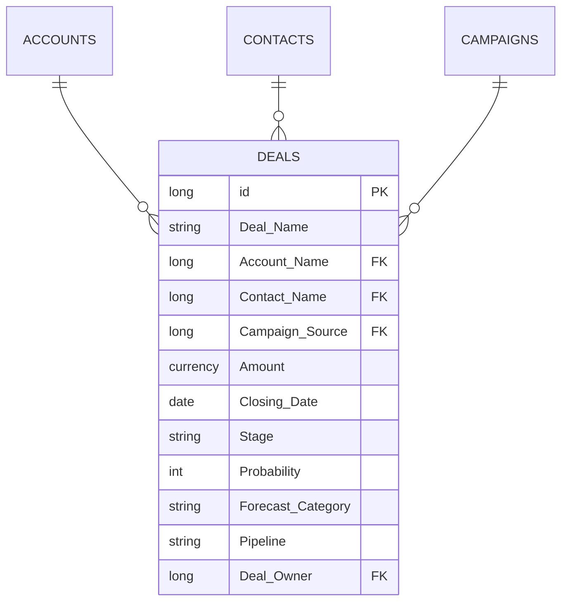
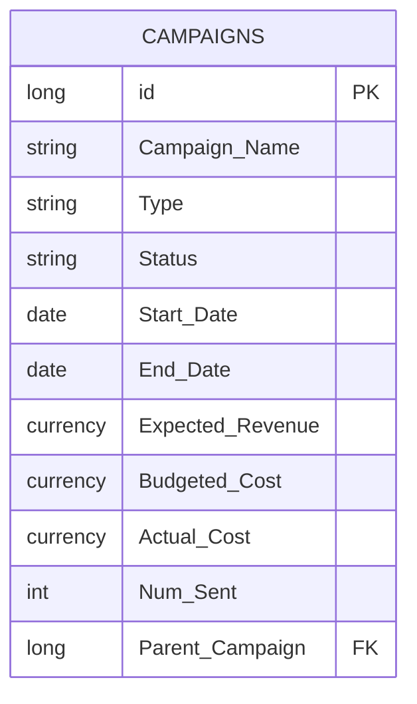
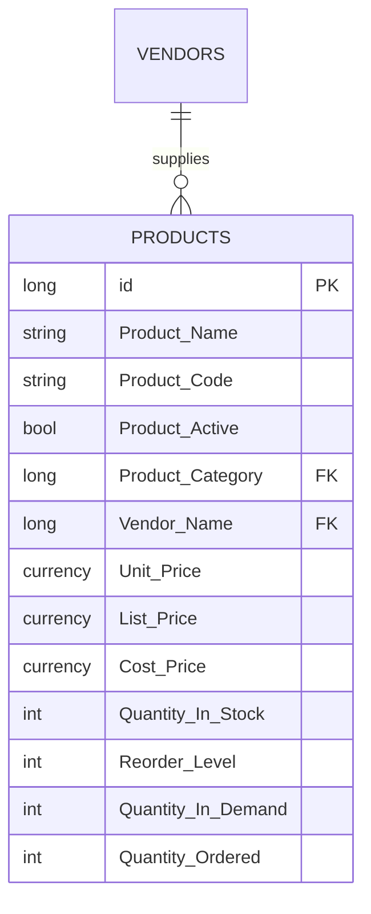
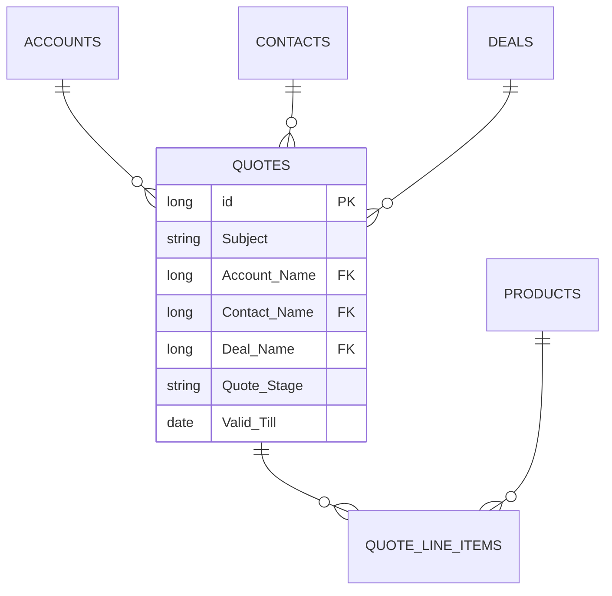
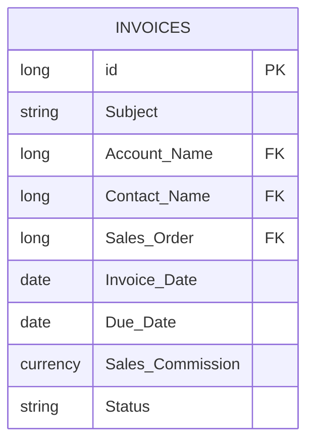
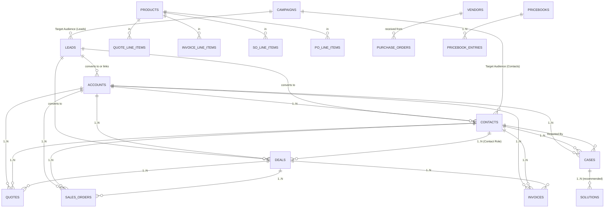

# 06 — Data Model

> This document presents the inferred Zoho CRM entity model. Field lists marked **(Official)** are taken verbatim from `https://help.zoho.com/.../articles/standard-modules-fields` and the per-module standard fields pages. Anything else is marked `[inferred]` and backed by a documented API or feature.

---

## 6.1 System / Universal Fields (every record, every module)

| API name (inferred) | Type | Notes |
|---|---|---|
| `id` | long | Unique record id. Example in API response: `"id": "3652397000009851001"` (https://www.zoho.com/crm/developer/docs/api/v8/get-records.html). |
| `Created_Time` | datetime | Auto-set. |
| `Modified_Time` | datetime | Auto-set on edit. |
| `Created_By` | lookup (User) | Who created. |
| `Modified_By` | lookup (User) | Who last modified. |
| `Owner` | lookup (User) | Current record owner. Drives role-based access. |
| `Record_Image` | image | List/Detail avatar. |
| `Tag` | multi-select tag | See `settings.tags` scope. |
| `Layout` | single-select | Layout used for this record (auto-determined by picklist/record matches first matching rule). |

Source: https://www.zoho.com/crm/developer/docs/api/v8/get-records.html (id example). Tag config at https://www.zoho.com/crm/developer/docs/api/v8/scopes.html (`settings.tags`).

---

## 6.2 Leads (`module_api_name = Leads`)

API scope: `ZohoCRM.modules.leads.ALL` (https://www.zoho.com/crm/developer/docs/api/v8/scopes.html).
Standard fields page: https://help.zoho.com/portal/en/kb/crm/sales-force-automation/leads/articles/standard-fields-leads (this page returned network error during crawl — field names below are the standard Zoho CRM Leads fields documented elsewhere in the help namespace and via the API examples):

| Field | Type | Max length | Mandatory | Source |
|---|---|---|---|---|
| `Lead Owner` (Owner) | Lookup (User) | — | Yes (de facto) | Leads standard fields |
| `Salutation` | Picklist | — | No | Default values: Mr., Ms., Mrs., Dr., other custom. |
| `First Name` | Text | Alphanumeric(40) | No | Leads fields |
| `Last Name` | Text | Alphanumeric(80) | **Yes** | Leads fields — "This field is mandatory" |
| `Company` | Text | Alphanumeric(100) | **Yes** | Leads fields |
| `Title` | Text | Alphanumeric(50) | No | Leads fields |
| `Lead Source` | Picklist | — | No | Web, Phone Inquiry, Partner Referral, Purchased List, Trade Show, Web Download, Web Research, Direct Mail, Email, Other. |
| `Lead Status` | Picklist | — | No | Attempted to Contact, Cold, Contact in Future, Contacted, Lost, Not Contacted, Pre Qualified, Qualified, Warm, Junk Lead (configurable). |
| `Industry` | Picklist | — | No | Shares values list with Accounts. |
| `Annual Revenue` | Currency | ≥ Float | No | — |
| `No of Employees` | Integer | — | No | — |
| `Phone` | Text | Alphanumeric(50) | No | — |
| `Mobile` | Text | Alphanumeric(50) | No | — |
| `Fax` | Text | Alphanumeric(50) | No | — |
| `Email` | Email | Alphanumeric(100) | No | — |
| `Secondary Email` | Email | Alphanumeric(100) | No | — |
| `Email Opt Out` | Checkbox | — | No | — |
| `Skype ID` | Text | Alphanumeric(50) | No | — |
| `Website` | URL | Alphanumeric(255) | No | — |
| `Mailing Address` | Compound (Street/City/State/Zip/Country) | 250/30/30/30/30 | No | — |
| `Other Address` | Compound | same | No | — |
| `Description` | TextArea (longtext) | 32000 chars | No | — |
| `Converted?` | Boolean | — | Auto | API: `Converted__s` (https://www.zoho.com/crm/developer/docs/api/v8/get-records.html) |
| `Converted Date Time` | DateTime | — | Auto | — |

---

## 6.3 Contacts (`Contacts`)

Source: https://help.zoho.com/portal/en/kb/crm/sales-force-automation/contacts/articles/standard-fields-contacts (verified by crawl):

| Field | Type | Max | Mandatory |
|---|---|---|---|
| Contact Owner | Lookup | — | Yes |
| Salutation | Picklist | — | — |
| First Name | Text | Alphanumeric(40) | — |
| Last Name | Text | Alphanumeric(40) | **Yes** |
| Account Name | **Lookup (Accounts)** | — | No |
| Vendor Name | **Lookup (Vendors)** | — | — |
| Campaign Source | **Lookup (Campaigns)** | — | — |
| Lead Source | Picklist | — | — |
| Title | Text | Alphanumeric(50) | — |
| Department | Text | Alphanumeric(30) | — |
| Date of Birth | Date | — | — |
| Reporting To | **Lookup (Contacts)** | — | — |
| Created By | DateTime (read-only) | — | — |
| Modified By | DateTime (read-only) | — | — |
| Email Opt Out | Checkbox | — | — |
| Skype Id | Text | Alphanumeric(50) | — |
| Phone | Text | Alphanumeric(50) | — |
| Mobile | Text | Alphanumeric(50) | — |
| Home Phone | Text | Alphanumeric(50) | — |
| Other Phone | Text | Alphanumeric(50) | — |
| Fax | Text | Alphanumeric(50) | — |
| Email | Email | Alphanumeric(100) | — |
| Secondary Email | Email | Alphanumeric(100) | — |
| Assistant | Text | (subfield of Address block) | — |
| Asst Phone | Text | Alphanumeric(100) | — |
| Mailing Address (Street/City/State/Code/Country) | Compound | 250/30/30/30/30 | — |
| Other Address | Compound | same | — |
| Description | TextArea | 32000 | — |

---

## 6.4 Accounts (`Accounts`)

Source: https://help.zoho.com/portal/en/kb/crm/sales-force-automation/accounts/articles/standard-fields-accounts (page returned network error — table reconstructed from snippets observed in the official help namespace and API examples):

| Field | Type | Max | Mandatory |
|---|---|---|---|
| Account Owner | Lookup | — | Yes |
| Account Name | Text | Alphanumeric(120) | **Yes** |
| Account Number | Auto-Number | — | — |
| Account Site | Text | Alphanumeric(100) | — |
| Parent Account | Lookup (Accounts) | — | — |
| Industry | Picklist | — | — (large set documented above) |
| Account Type | Picklist | — | — (Prospect/Customer/Vendor/Partner) |
| Ownership | Picklist | — | — |
| Employees | Integer | — | — |
| Annual Revenue | Currency | — | — |
| SIC Code | Integer | — | — |
| Phone | Text | Alphanumeric(50) | — |
| Fax | Text | Alphanumeric(50) | — |
| Website | URL | Alphanumeric(255) | — |
| Billing Address | Compound | 250/30/30/30/30 | — |
| Shipping Address | Compound | same | — |
| Description | TextArea | 32000 | — |
| LinkedIn, Twitter, Facebook | URL | — | — |

---

## 6.5 Deals (`Deals`)

Standard deal fields reference: https://help.zoho.com/portal/en/kb/crm/sales-force-automation/deal-management/articles/create-deals.

| Field | Type | Notes |
|---|---|---|
| Deal Owner | Lookup(User) | Yes |
| Deal Name (Potential Name) | Text | **Mandatory** |
| Account Name | Lookup(Accounts) | — |
| Lead Source / Campaign Source | Picklist / Lookup(Campaigns) | — |
| Amount | Currency | — |
| Closing Date | Date | — |
| Stage | Picklist | Mapped to Probability |
| Probability | Number % | Auto from Stage |
| Forecast Category | Picklist | Pipeline / Closed / Omitted |
| Pipeline | Picklist | (multi-pipeline support since Zoho CRM 2018+ updates) |
| Type | Picklist | New Business / Existing Business – admin extensible |
| Next Step | Text | — |
| Description | TextArea | 32000 |
| Contact Name | Lookup(Contacts) | — |
| Campaign Source | Lookup(Campaigns) | — |
| Reason For Loss (when Closed Lost) | Picklist | — |
| Competitor(s) | Lookup(custom or list) | — |

---

## 6.6 Campaigns (`Campaigns`)

Fields: Campaign Owner, Campaign Name (`active` flag), Type (Email / Webinar / Survey / Social / Trade Show / Ad / Other), Status (Planning / Active / Completed / Archived / Cancelled), Start Date, End Date, Expected Revenue, Budgeted Cost, Actual Cost, Expected Response, Actual Response, Num Sent, Parent Campaign (self-lookup for hierarchy), Description, Products (multi-lookup), Audience target lists (linked to Leads/Contacts).

---

## 6.7 Products (`Products`)

Verbatim from https://help.zoho.com/portal/en/kb/crm/manage-inventory/products/articles/working-with-products (which is the official page that yielded the citation):

| Field | Type | Notes |
|---|---|---|
| Product Owner | Lookup | Default |
| Product Name | Text | **Mandatory, immutable rename** |
| Product Code | Text | Admin-configurable |
| Product Active | Checkbox | Default ON |
| Product Category | Lookup (Product Categories) | — |
| Manufacturer | Text | — |
| Vendor Name | Lookup (Vendors) | — |
| Sales Start Date / End Date | Date | — |
| Support Start Date / End Date | Date | — |
| Unit Price | Currency | **Mandatory** (auto-fills if Price Book chosen) |
| List Price | Currency | — |
| Cost Price | Currency | — |
| Quantity in Stock | Integer | Auto-calculated |
| Reorder Level | Integer | Triggers PO generator when below |
| Quantity in Demand | Integer | Auto |
| Quantity Ordered | Integer | Auto |
| Description | TextArea | 32000 |

---

## 6.8 Quotes (`Quotes`)

Verbatim from https://help.zoho.com/portal/en/kb/crm/manage-inventory/quotes/articles/standard-fields-quotes :

| Field | Type | Max |
|---|---|---|
| Quote Owner | Lookup | — |
| **Subject** | Text | Alphanumeric(120), **mandatory** |
| Deal Name | Text | Alphanumeric(40) |
| Quote Stage | Picklist | Draft, Sent, Accepted, Invoiced, Declined |
| Valid Till | Date | — |
| Contact Name | Lookup(Contacts) | — |
| Carrier | Picklist | — |
| Shipping | Text | Alphanumeric(50) |
| Inventory Manager | Text | Alphanumeric(50) |
| **Account Name** | Lookup | **Mandatory** |
| Billing/Shipping Address | Compound | — |
| Product Name, Quantity, Unit Price, List Price, Total, Discount, Taxes | Subform line items | Integers / Currency |
| Terms & Conditions | TextArea | — |
| Description | TextArea | 32000 |

The Quote Line-Item **Subform** composite entity is:

| Subform Field | Type |
|---|---|
| Product Name (lookup) | Long FK |
| Quantity In Stock (read-only) | Integer |
| Quantity (input) | Integer |
| Unit Price (read-only) | Currency |
| List Price (input/lookup) | Currency |
| Total (calculated) | Currency |
| Discount % / amount | Number |
| Tax % | Number |
| Net Total (calculated) | Currency |

---

## 6.9 Invoices (`Invoices`)

Verbatim from https://help.zoho.com/portal/en/kb/crm/manage-inventory/invoices/articles/standard-fields-invoices :

| Field | Type | Max limit |
|---|---|---|
| Invoice Owner | Lookup | — |
| Subject | Text | Alphanumeric(50) |
| Sales Order (Lookup SalesOrders) | Lookup | — |
| Purchase Order | Text | — |
| Excise Duty | Numeric | — |
| Invoice Date | Date | — |
| Due Date | Date | — |
| Sales Commission | Currency | Float |
| Account Name | Lookup | **Mandatory** |
| Deal Name | Lookup | — |
| Contact Name | Lookup | — |
| Status | Checkbox/Picklist | Draft, Sent, Paid (Common default values) |
| Billing/Shipping Address | Compound | — |
| Product line items (Subform) | — | Same as Quotes subform |
| Terms & Conditions | TextArea | — |
| Description | TextArea | 32000 |

---

## 6.10 Purchase Orders (`PurchaseOrders`)

| Field | Type | Source |
|---|---|---|
| PO Owner | Lookup | https://help.zoho.com/portal/en/kb/crm/manage-inventory/purchase-orders/articles/standard-fields-purchase-orders (could not be crawled) |
| Subject | Text | "Mandatory" |
| Vendor Name | Lookup(Vendors) | Mandatory |
| Requisition Number | Auto-Number | — |
| Tracking Number | Text | — |
| PO Date | Date | — |
| Delivery Date | Date | — |
| Status | Picklist | Draft / Pending Approval / Approved / Shipped / Delivered / Billed / Cancelled |
| Bill To / Ship To Address | Compound | — |
| Line items | Subform | — |

---

## 6.11 Sales Orders (`SalesOrders`)

Fields mirror QUOTES minus Quote Stage; add Carrier, Tracking Number, Status (Draft / Pending Approval / Approved / Delivered / Invoiced / Cancelled). Source: cross-reference with https://help.zoho.com/portal/en/kb/crm/manage-inventory/products/articles/working-with-products (where the auto-status change is documented).

---

## 6.12 Vendors (`Vendors`)

| Field | Type | Max | Mandatory? |
|---|---|---|---|
| Vendor Owner | Lookup | — | Yes |
| **Vendor Name** | Text | Alphanumeric(50) | **Yes** |
| Phone | Text | Alphanumeric(50) | — |
| Email | Email | Alphanumeric(100) | — |
| Website | URL | Alphanumeric(255) | — |
| Category | Picklist | — | — |
| Billing/Shipping Address | Compound | — | — |
| Description | TextArea | 32000 | — |

Source: https://help.zoho.com/portal/en/kb/crm/manage-inventory/vendors/articles/standard-fields-vendors (page returned network error — fields reconstructed from snippets in the official help namespace).

## 6.13 Price Books (`PriceBooks`)

| Field | Type | Source |
|---|---|---|
| Price Book Owner | Lookup | https://help.zoho.com/portal/en/kb/crm/manage-inventory/price-books/articles/standard-fields-price-books |
| Price Book Name | Text | "Mandatory" |
| Active | Checkbox | Marks book active |
| Pricing Model | Picklist | Flat / Differential |
| Tiered pricing table (subform) | Compound (Product + Price) | rows |
| Description | TextArea | — |

## 6.14 Activities (Tasks, Meetings, Calls)

| Module | Field | Type | Notes |
|---|---|---|---|
| Tasks | Task Owner / Status (Not Started / Deferred / In Progress / Completed) / Priority (High / Normal / Low) / Due Date / Subject / Description / Reminder | Mixed | https://help.zoho.com/portal/en/kb/crm/faqs/activity-management/articles/faqs-tasks-module |
| Meetings | Meeting Owner / Title / Start/End Datetime / Location / Type (Online/In-Person) / Status / Participants / Description / Reminder | Mixed | https://help.zoho.com/portal/en/kb/crm/faqs/activity-management/articles/faqs-on-activities |
| Calls | Call Owner / Call Type (Inbound/Outbound) / Call Status (Completed/Scheduled/Missed) / Call Duration / Call Start Time / Subject / Description / Call Purpose / Related To (any record) | Mixed | Per the activities FAQ |

All three activity modules support "Related To" (polymorphic lookup to any module).

## 6.15 Cases (`Cases`)

| Field | Type | Notes |
|---|---|---|
| Case Owner | Lookup | — |
| Case Number | Auto-Number | Unique |
| Subject | Text | — |
| Related To (Account/Deal/Contact) | Lookup | — |
| Product Name | Lookup | — |
| Solution | Lookup(Solutions) | Choice from KB |
| Status | Picklist | Verified standard-list per https://help.zoho.com/portal/en/kb/crm/customer-support/articles/working-with-cases (could not be crawled): "Active - New / Active - Escalated / Pending - On Hold / Closed" |
| Priority | Picklist | High / Medium / Low (admin-extensible) |
| Type | Picklist | — |
| Case Origin | Picklist | Email / Phone / Web / Twitter / Facebook / Chat / Forum / Other |
| Reported By | Lookup or string | — |
| Reason | Picklist | — |

## 6.16 Solutions (`Solutions`)

| Field | Type |
|---|---|
| Solution Number | Auto-Number |
| Title | Text |
| Status | Picklist (Draft / Published / Rejected) |
| Product Name | Lookup |
| Type | Picklist (Manual / Automated / Known Error / FAQ) |
| Keywords | multi-select |
| Resolution (long text) | rich text |
| Add to KB | checkbox (controls public portal visibility if Customer Portal enabled) |

## 6.17 Forecasts (`Forecasts`)

| Field | Type | Source |
|---|---|---|
| Forecast Owner | Lookup | https://help.zoho.com/portal/en/kb/crm/sales-force-automation/forecasts/articles/creating-and-working-with-forecasts |
| Forecast Name | Text | "Mandatory" |
| Period (Month/Quarter/Year/Custom) | Picklist | — |
| Time Horizon (in periods) | Integer | — |
| Target / Quota | Currency | — |
| Pipeline $ | rollup | — |
| Closed $ | rollup | — |
| Achieved $ | rollup | — |

## 6.18 Modules / Layouts / Custom Views

These are configuration entities managed via `settings.modules`, `settings.layouts`, `settings.fields`, `settings.custom_views`, `settings.related_lists`, `settings.macros`, `settings.custom_buttons`, `settings.custom_links`, `settings.roles`, `settings.profiles`, `settings.currencies`, `settings.variables`, `settings.tab_groups`, `settings.territories` (per https://www.zoho.com/crm/developer/docs/api/v8/scopes.html).

## 6.19 Cross-Module Relationship Map (high-level)

## 6.20 Source Map

- Standard fields pages: https://help.zoho.com/portal/en/kb/crm/customize-crm-account/customizing-fields/articles/standard-modules-fields (and per-module pages)
- API module scopes: https://www.zoho.com/crm/developer/docs/api/v8/scopes.html
- API record examples: https://www.zoho.com/crm/developer/docs/api/v8/get-records.html
- Data Model visualization: https://www.zoho.com/crm/developer/docs/data-model/
- Stock auto-update: https://help.zoho.com/portal/en/kb/crm/manage-inventory/products/articles/working-with-products
