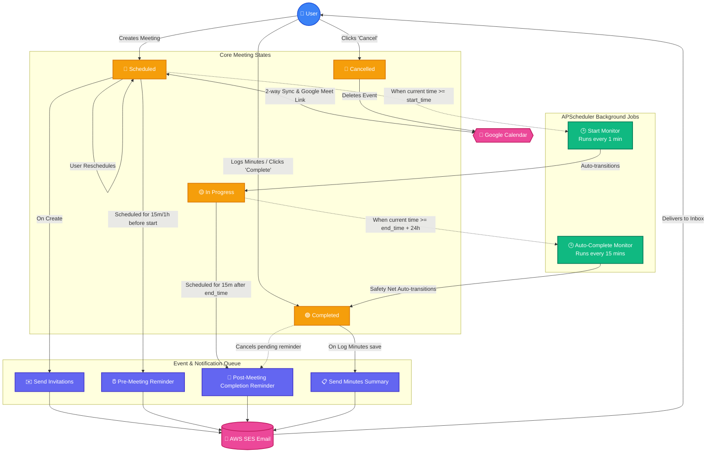

# Meeting Lifecycle Diagram

```mermaid
graph TD
    %% Styling
    classDef user fill:#3b82f6,stroke:#1d4ed8,stroke-width:2px,color:#fff;
    classDef state fill:#f59e0b,stroke:#d97706,stroke-width:2px,color:#fff;
    classDef system fill:#10b981,stroke:#047857,stroke-width:2px,color:#fff;
    classDef queue fill:#6366f1,stroke:#4338ca,stroke-width:2px,color:#fff;
    classDef ext fill:#ec4899,stroke:#be185d,stroke-width:2px,color:#fff;

    User((👤 User)):::user
    GC{{📅 Google Calendar}}:::ext
    SES[(📧 AWS SES Email)]:::ext

    %% Core States
    subgraph Core Meeting States
        Scheduled[🔵 Scheduled]:::state
        InProgress[🟡 In Progress]:::state
        Completed[🟢 Completed]:::state
        Cancelled[🔴 Cancelled]:::state
    end

    %% User Actions
    User -->|"Creates Meeting"| Scheduled
    Scheduled -->|"User Reschedules"| Scheduled
    User -->|"Clicks 'Cancel'"| Cancelled
    User -->|"Logs Minutes / Clicks 'Complete'"| Completed

    %% System Jobs
    subgraph APScheduler Background Jobs
        StartMonitor[🕒 Start Monitor<br/>Runs every 1 min]:::system
        EndMonitor[🕒 Auto-Complete Monitor<br/>Runs every 15 mins]:::system
    end

    Scheduled -.->|"When current time >= start_time"| StartMonitor
    StartMonitor -->|"Auto-transitions"| InProgress

    InProgress -.->|"When current time >= end_time + 24h"| EndMonitor
    EndMonitor -->|"Safety Net Auto-transitions"| Completed

    %% Notifications Flow
    subgraph Event & Notification Queue
        InviteJob[✉️ Send Invitations]:::queue
        ReminderJob[⏰ Pre-Meeting Reminder]:::queue
        CompletionJob[🔔 Post-Meeting Completion Reminder]:::queue
        MinutesJob[📋 Send Minutes Summary]:::queue
    end

    Scheduled -->|"On Create"| InviteJob
    Scheduled -->|"Scheduled for 15m/1h before start"| ReminderJob
    
    %% Post meeting hooks
    InProgress -->|"Scheduled for 15m after end_time"| CompletionJob
    Completed -.->|"Cancels pending reminder"| CompletionJob
    
    Completed -->|"On Log Minutes save"| MinutesJob

    InviteJob --> SES
    ReminderJob --> SES
    CompletionJob --> SES
    MinutesJob --> SES
    
    SES -->|"Delivers to Inbox"| User

    %% Integrations
    Scheduled <-->|"2-way Sync & Google Meet Link"| GC
    Cancelled -->|"Deletes Event"| GC
```
