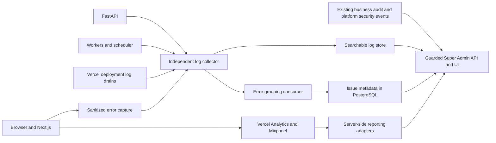

# Super Admin Upgrade Plan: Analytics, Error Tickets and Application Logs

Date: 4 October 2026; source-checked revision: 5 October 2026
Status: proposed implementation plan; no application changes or provider setup performed.

Confirmed hosting: frontend on Vercel, backend on AWS. Mixpanel account/project still needs to be created. AWS compute type (ECS, EC2, Lambda or another service), Vercel account capabilities and existing AWS logging setup remain to be confirmed.

## Outcome

Upgrade the existing Super Admin portal with three connected capabilities:

1. Product and traffic analytics using Vercel Web Analytics and Mixpanel.
2. An Error Center that captures failures, groups repeat occurrences into tickets, and supports investigation, assignment, status updates and verification.
3. A searchable Application Logs view covering the browser, Next.js server, FastAPI, workers, scheduler, integrations and deployments.

Example: a Teamspace import fails. Its failure appears in Error Center, with the affected module, environment, release and request ID. A platform administrator opens the related request/job logs, assigns the issue, records the fix, and verifies the release. Repeated occurrences update the same ticket instead of creating hundreds of tickets.

## Verified current implementation

| Area | Current implementation | Upgrade needed |
|---|---|---|
| Platform dashboard | Organization/user/subscription/feedback and record-volume aggregates | Product usage, operational health and real failure metrics |
| Portal navigation | Overview, tenants/members, login tracking, trial extensions, feedback, owner-only platform access | Analytics, Error Center and Application Logs |
| Platform authentication | Separate platform accounts, server sessions, MFA enrollment/challenge, CSRF protection and owner-only access management | Reuse this boundary; add capabilities for sensitive observability operations |
| Backend logs | JSON formatter, configurable severity and request/correlation middleware; generic 500 handling currently loses its request ID and traceback | Fix error handling first; then redaction, request summaries, consistent worker format, central collection and searchable storage |
| Health | Existing database/Redis checks, S3 configuration inspection and process-local scheduler inspection; public detailed/readiness routes expose diagnostics | Minimal public probes, guarded detailed health, remote worker heartbeat and measured dashboard states |
| Frontend errors | Shared API console logging and a Teamspace error boundary | Central capture, application-wide boundaries and persistent issue tracking |
| Organization audit | Organization-scoped business audit records | Add a guarded platform search view; preserve organization access restrictions |
| Feedback | Read/search/statistics across tenants | Allow feedback-to-ticket linking; feedback itself is not an error occurrence database |
| Analytics providers | No Vercel Analytics or Mixpanel integration found in package/source searches | Add SDKs, event contracts and provider reporting adapters |

Source evidence:

- Frontend: `src/components/superadmin/SuperAdminSidebar.tsx`, `src/app/superadmin/dashboard/page.tsx`, `src/app/superadmin/layout.tsx`, `src/lib/api/platformHttpClient.ts`, `src/lib/api/httpClient.ts`, `src/app/dashboard/teamspace/error.tsx`, `src/app/layout.tsx`.
- Backend: `src/shared/auth/superadmin_guard.py`, `src/modules/platform_auth/services/sessions.py`, `src/modules/platform_auth/handlers/login.py`, `src/modules/superadmin/repositories/superadmin_dashboard_repo.py`, `src/modules/superadmin/routes/feedback_routes.py`, `src/shared/logging/structured_logger.py`, `src/shared/middleware/correlation_middleware.py`, `src/shared/exceptions/global_handlers.py`, `src/shared/routes/health_routes.py`, `src/shared/services/health_service.py`, `src/main.py`, `src/modules/pipelines/services/pipeline_seed_service.py`, `src/worker.py`, `src/shared/services/queue_service.py`, `src/modules/audit_logs/repositories/models.py`.

## Audit findings and planning corrections

The supplied audit was checked against the current source. A synthetic FastAPI app using the existing correlation middleware and exception handlers reproduced the error-path findings without starting the CRM lifespan or connecting to its database:

```text
Unexpected RuntimeError: HTTP 500, request_id="", X-Request-ID absent, traceback absent from the handler log record.
Oversized request ID containing a newline: echoed unchanged.
Internal ValueError: HTTP 400, raw exception message returned.
```

| Priority | Verified defect | Required correction |
|---|---|---|
| Critical | Startup calls `reset_all_org_lead_pipelines()`. Successful resets delete custom stages/document rules, clear stage-history references, overwrite canonical probabilities/colours/order, remap every lead by status and delete other lead pipelines | Remove the startup caller. Preserve provisioning through existing lazy seeding; test custom pipelines, canonical customizations, lead placement and history across restarts |
| Critical | The generic exception handler runs outside the correlation context and logs with `exc_info=True` outside an active exception context | Persist IDs in request state, explicitly supply the exception/traceback tuple, and attach response headers in the outer error handler |
| High | Both request and correlation IDs accept unchecked values | Validate and bound both IDs; replace invalid values, including control characters and excessive length |
| High | All `ValueError`s become raw-message 400s; SQLAlchemy errors interpolate exception text, including SQL parameters, into logs | Introduce explicit domain validation errors; preserve intended client errors while returning generic 500s for unknown bugs. Emit sanitized database diagnostics without SQL parameters |
| High | Detailed health and readiness are public; readiness includes the same database error/pool details | Make both public probe variants minimal; move sanitized details behind platform authentication |
| High, planning | `public_analytics_setup.md` claims implementation, but the SDK dependencies, analytics example configuration, named analytics test and claimed backend public-AI events are absent | Mark that document as `PLANNED / DOCUMENTED ONLY`. Establish rollback provenance before choosing restoration or reimplementation |
| Medium | Worker logging is plain text, frontend capture has only the Teamspace boundary, and the platform has no granular capability model | Reuse existing logging/platform-session foundations; add consistent worker context, app-wide capture and explicit capabilities |
| Medium | ALL SYSTEMS HEALTHY is literal text; scheduler inspection sees only the API process; S3 inspection checks configuration rather than reachability | Use measured health and freshness. Add worker/scheduler heartbeats; do not label configured storage as verified healthy |

`alembic heads` returned the single repository head `20261005_standard_team_pool` on 5 October 2026. This verifies the migration graph, not whether any deployed database has applied it. Keep the existing explicit model imports in `tests/conftest.py`, including `PlatformSecurityEvent`.

The audit's corrected phases need three adjustments. An API-hosted telemetry endpoint is a development bridge, not independent production collection. Repository implementation of capabilities and grouping can proceed before AWS decisions, but enabling their production capture requires the independent collector. Safety fixes are enabled changes, not default-off features; a rollback must not restore destructive startup behavior or diagnostic disclosure. The claim that analytics disappeared in a rollback remains an inference until Git history identifies the relevant change. No `PlatformAnalyticsProvider.tsx` exists; any such provider is a proposed new file.

## Proposed Super Admin experience

| Location | User-facing purpose |
|---|---|
| `/superadmin/dashboard` | Actual platform health, open critical tickets, error rates, usage summaries and delivery freshness |
| `/superadmin/analytics` | Vercel traffic and Mixpanel product usage, funnels and retention |
| `/superadmin/errors` | Grouped tickets plus an All Failures view for individual captured failures |
| `/superadmin/errors/[id]` | Stack/details, occurrences, linked logs, assignee, comments, status and release verification |
| `/superadmin/logs` | Runtime Logs, Business Audit and Platform Security subviews with common filters |

Keep existing tenant, access, login-history, feedback and trial-extension pages. Add links between feedback and issues, and between issue occurrences and request/job logs.

## Architecture and ownership



Recommended starting point for your confirmed hosting: keep issue workflow metadata in PostgreSQL, use AWS CloudWatch Logs for runtime logs, and query them through a guarded backend adapter using Logs Insights. Feed Vercel deployment logs into AWS through a separately hosted HTTPS drain receiver. Use an independent AWS collection path so a FastAPI outage does not disable error ingestion. Mixpanel requires creating an account/project before enabling collection. [CloudWatch Logs Insights](https://docs.aws.amazon.com/AmazonCloudWatch/latest/logs/AnalyzingLogData.html).

A concrete collection design is API Gateway + a small Lambda receiver + a dedicated SQS telemetry queue, with signature verification/redaction before accepted payloads are delivered to CloudWatch and the error grouping consumer. Bound payload sizes, preserve stable event IDs, batch carefully, use retry/dead-letter policies and monitor lag. This new telemetry queue is independent of the existing CRM business queue. Verify the existing AWS stack before creating infrastructure; reuse safe compatible resources where possible.

For ECS, use the awslogs driver; for EC2, use a configured log agent; for Lambda, configure structured runtime output and CloudWatch retention. Source services remain a deployment decision. A CloudWatch subscription or equivalent collection consumer can forward eligible error events into the grouping queue; prevent a subscription from feeding collector diagnostics back into itself. Keep the issue metadata consumer durable while PostgreSQL is unavailable. [ECS logging](https://docs.aws.amazon.com/AmazonECS/latest/developerguide/using_awslogs.html), [CloudWatch subscriptions](https://docs.aws.amazon.com/AmazonCloudWatch/latest/logs/SubscriptionFilters.html).

Runtime logs, business audit records and product analytics have different retention, access and delivery requirements. The portal gives them linked views. Do not put every runtime log into the CRM `audit_logs` table or treat an analytics event as proof of a committed business change.

## Requirement 1: Vercel Analytics and Mixpanel

Use Vercel for traffic/page popularity and Mixpanel for feature adoption, funnels and retention. Vercel provides a Web Analytics API for server-side reports; project access, reporting windows and account entitlements must be checked before enabling dashboard cards. Its custom events have plan requirements. [Vercel API](https://vercel.com/docs/analytics/web-analytics-api), [custom events](https://vercel.com/docs/analytics/custom-events).

Implementation:

- Add one typed analytics service and a client provider at the application interaction boundary. Initialize once; separate production and development/preview data.
- Vercel: sanitized route/page tracking, traffic/referrer/device summaries and optional high-level conversion events.
- Mixpanel: curated events such as `onboarding_completed`, `module_viewed`, `import_submitted`, `import_completed`, `governed_action_executed`, `report_generated` and `subscription_changed`.
- Identify authenticated users using opaque identifiers; attach an opaque organization identifier where justified. Reset identity on logout and clear organization context on account/tenant switching. Start with autocapture disabled and session replay disabled. [Mixpanel SDK](https://docs.mixpanel.com/docs/tracking-methods/sdks/javascript).
- Use allowlisted properties: module, action category, record count, duration, outcome, environment and release. Exclude customer names, emails, phone numbers, record contents, search text, uploaded file content, tokens and business reasons.
- Normalize dynamic paths and remove query strings before analytics transmission. Exclude platform login/access/MFA pages from product tracking by default.
- Define each event's authoritative emitter. A client submission is an attempt; the backend emits successful business completion only after commit. Emit retries with stable event IDs through a committed event/outbox path to avoid double counting.
- Provide provider enable/disable controls, applicable consent handling, ingestion health, budget limits and degraded-state indicators. Analytics failure must never block CRM writes or login.
- Add backend Vercel and Mixpanel reporting adapters with server-only credentials, timeouts, cache keys containing all filters, rate limiting and clearly displayed freshness. Browser code receives only permitted aggregate reports. [Mixpanel Query API](https://docs.mixpanel.com/reference/query-api).

First dashboard: active users/organizations by defined reporting window, module adoption, onboarding funnel, import success/failure, governance usage, report usage and conversion. Define timezone, event time, activation and active-user rules before comparing provider figures with database counts. Mixpanel organization group reporting depends on the chosen account features; ordinary event-property filtering can be the initial implementation.

## Requirement 2: Error Center with ticket workflow

Capture browser exceptions and unhandled rejections, React boundary failures, Next.js server failures, unexpected API errors, failed jobs and integration failures. Use Next.js `instrumentation-client.ts`, `instrumentation.ts` and application/global error boundaries as appropriate, verifying the APIs against the installed Next.js version. [Client instrumentation](https://nextjs.org/docs/app/api-reference/file-conventions/instrumentation-client), [server instrumentation](https://nextjs.org/docs/app/api-reference/file-conventions/instrumentation).

Every instrumented failure should be discoverable in All Failures. Unexpected failures automatically create or update a ticket. Expected 401/403/409/422 responses remain classified failure events by default, with manual promotion and configurable thresholds. A correctly rejected spreadsheet stage is not automatically a server bug. Unexpected validation failures can still become tickets.

Workflow:

`Open -> Triaged -> In Progress -> Fix Deployed -> Resolved`

Additional states: Reopened, Ignored and Duplicate. Keep severity separate from status. Record why an issue is ignored, which issue a duplicate belongs to, the fix/release reference, verification evidence, and all transitions. Resolving a ticket records investigation state; it does not change application code or erase its occurrences. A recurrence in a release at or after the recorded fix can reopen it; late events from older releases must not reopen a verified new release automatically.

Proposed models:

| Model | Fields / purpose |
|---|---|
| `platform_issues` | ID, short ticket number, fingerprint/version, environment, source/service, title, severity, status, assignee, first/last seen, occurrence count, verification/fix release, optimistic version |
| `platform_issue_occurrences` | Stable event ID, issue ID, observed/received time, trusted organization/user references where available, request/trace/job IDs, release, normalized route, safe error class/code/message and log reference |
| `platform_issue_activity` | Immutable status/assignment/comment/merge history, actor and timestamps |
| `platform_issue_feedback_links` | Links to existing feedback records without duplicating feedback content |

Store large, sanitized stack traces and occurrence payloads in the log backend with bounded retention. Keep workflow metadata and references in PostgreSQL. Enforce unique issue identity per environment/service/fingerprint version/fingerprint and unique occurrence delivery identity per source/event ID; increment counters atomically. Use server-validated deployment chronology for fix verification, not lexical comparison of commit hashes. A fingerprint groups service + environment + error class/code + normalized route + relevant stack frames; preserve release as occurrence metadata so a fix can be verified across releases. Deduplicate event delivery separately from issue grouping, and preserve distinct organization impact within a shared issue.

Issue details should provide occurrence trends, affected tenant counts, safe stack frames, first/last occurrence, representative events, linked logs, deployment/commit references, comments and assignee. Source maps must be privately stored/uploaded and matched to release; never expose original source and stacks to CRM customers. Browser-supplied identity, severity and organization are untrusted; enrich from validated sessions where possible and mark anonymous reports as unverified.

Browser error capture must use a separate collection endpoint, not a platform-admin cookie endpoint. Server/Vercel/worker ingestion uses service credentials or verified drain signatures; untrusted browser reports use bounded schemas and rate limits and cannot set trusted tenant identity, administrator status, or alert severity. Source-specific trust is preserved in every occurrence. Capture transport must be rate-limited, bounded and resilient. Independent collection is necessary because an exception transaction or CRM database outage can prevent an issue-row insert. Retain events outside the failing transaction, then consume them into ticket metadata with retries and idempotency. Isolate collector traffic from business jobs; never route network delivery through `queue_service.enqueue()` while `QUEUE_MODE=sync` and assume it is asynchronous. Failed telemetry submission must not recursively generate new tickets.

## Requirement 3: Application Logs

Provide a shared log envelope: UTC timestamp, event ID, environment, service/component, release/deployment, level, event name, sanitized message, trusted organization/user IDs when available, request/correlation/trace IDs, route template/method, status, duration and job/provider identifiers. Some infrastructure events have no organization or user; do not invent these fields.

Coverage:

| Source | Required coverage |
|---|---|
| Browser | Instrumented errors, API failure references and selected application events; no wholesale recording of form data or every console message |
| Next.js | SSR/route/action failures, proxy handling, deployment/release context and request summaries |
| FastAPI | Request completion/failure summaries, exceptions and domain/integration operation outcomes |
| Workers/scheduler | Enqueue/start/retry/fail/complete, duration, attempt count, dead-letter state and trace propagation |
| Integrations | Provider/action/status/latency, webhook processing, retries and delivery results without payload secrets |
| Imports/exports/governance | Batch/job/action IDs, selected scope, aggregate outcomes and links to authoritative business audit records |
| Infrastructure | Service restarts/crashes, deployment/build failures, resource health and sanitized database/connection diagnostics |

Reuse the JSON formatter, but add centralized recursive redaction and context enrichment. Apply redaction before stdout/export, including exception messages and SQLAlchemy error parameters. Exclude authorization/cookies/passwords/OTP/MFA keys, API keys, email contents, CRM payloads and unrestricted request/response bodies. Use route templates to avoid record identifiers appearing in message paths. Normalize tracebacks without logging local variable values.

Unify worker logging with API JSON output. Add structured request summaries instead of relying on production `uvicorn.access`, which is currently reduced to WARNING. Carry context through queues, scheduled jobs and outbox deliveries. Validate/bound incoming correlation IDs, generate trusted server request IDs, and preserve IDs through unhandled exceptions using request state/appropriate middleware ordering; expose the support reference in error responses.

For Vercel-hosted Next.js logs, configure Log Drains. Authenticate using the documented signature over the raw request body, validate project/environment, and deduplicate provider entry IDs. Externally hosted FastAPI/worker logs require their own collector. [Log Drains](https://vercel.com/docs/drains/reference/logs), [drain verification](https://vercel.com/docs/drains/security).

Log UI: filter by time, environment, service, severity, organization, module, release and request/trace/job/issue ID; saved searches, bounded auto-refresh, stable pagination over constrained results, context around an error, log-to-ticket promotion and audited exports. Use server-generated constrained queries and time/result limits; never accept arbitrary Logs Insights queries, log groups or external URLs from the browser. Scope the AWS read role to approved log groups; rate-limit queries, bound the time window and scanned volume, cache suitable results, and redact exported rows. Keep request/user/tenant IDs in structured log fields; do not create unlimited metric dimensions from these identifiers. The portal should manage asynchronous query status and timeout/cancellation through the backend adapter. Logs Insights does not supply the same pagination contract as a relational table: use bounded query snapshots and opaque application cursors where practical, with explicit result truncation and time-window continuation; do not promise unlimited scrolling across an arbitrary search.

Initial retention proposal, subject to volume and account policy: 30 days searchable runtime logs, 90 days failure occurrences, 12 months issue workflow history. Preserve existing organization audit retention policy; do not impose these runtime defaults on it. Archive longer to restricted S3 storage only when justified and configured. Store private release source maps in restricted S3 storage as well. Show collection lag, dropped-event counts and retention cutoffs. Entire application coverage means coverage of instrumented services and events; browser blockers, offline clients, process termination and provider outages can still cause gaps.

## Security and repository implementation boundaries

- Guard platform queries/commands with existing platform authentication and `require_super_admin`; retain owner-only access provisioning. Do not authorize new endpoints through CRM organization tokens.
- Introduce explicit capabilities for viewing logs/issues, updating issues, exporting diagnostic data and configuring providers. The owner grants them; default new platform accounts to minimum access. Keep CSRF/session revocation checks on writes.
- Cross-tenant visibility is an intentional platform permission. Tenant IDs from trusted backend context are authoritative; ordinary organization administrators cannot read platform endpoints.
- Audit sensitive searches/views, exports, provider/configuration changes and issue transitions in a platform operational audit stream. Reuse `PlatformSecurityEvent` for appropriate security/access events, without fabricating an organization for platform accounts or changing the tenant `AuditLog` contract.
- Add backend `platform_observability/{commands,queries,handlers,repositories,routes,services}` and a focused shared telemetry boundary. Integrations/log providers belong behind narrow service interfaces. Register routers in `src/main.py`.
- Use platform API services and focused TanStack Query hooks; keep filters, pagination and tabs in URL state. Redux remains UI-only. Extend `platformHttpClient` with typed write methods where needed while preserving CSRF handling.
- Add models to test initialization and create migrations from the single current Alembic head. Confirm one head before/after; no automatic DDL at startup.
- Use existing localization/date/number formatters and intentional SuperAdminSidebar navigation entries.

## Proposed API contracts

All operator endpoints use the existing platform session/CSRF boundary and `/api/v1/superadmin/...` prefix. The following are new proposed use cases, not existing routes:

| Contract | Purpose |
|---|---|
| `GET /superadmin/observability/health` | Measured dependency/service health, source freshness and last observed time |
| `GET /superadmin/analytics/overview` | Cached, sanitized provider aggregates with date/environment filters |
| `GET /superadmin/issues` | Filtered issue list with bounded pagination |
| `GET /superadmin/issues/{id}` | Issue details, verification metadata and links |
| `GET /superadmin/issues/{id}/occurrences` | Individual failures including trusted/unverified source classification |
| `POST /superadmin/issues/{id}/transition` | Validated status transition, reason, expected version, fix/verification metadata |
| `POST /superadmin/issues/{id}/assignment` | Assign to an eligible platform operator, with concurrency protection |
| `POST /superadmin/issues/{id}/comments` | Add an audited comment |
| `POST /superadmin/issues/{id}/duplicate` | Link/merge duplicates without deleting occurrence history |
| `POST /superadmin/logs/search` | Start a constrained CloudWatch query; return an opaque query handle |
| `GET /superadmin/logs/search/{handle}` | Query status and bounded result snapshot for the authorized operator |
| `POST /superadmin/logs/search/{handle}/cancel` | Cancel an owned/permitted query |
| `POST /superadmin/logs/export` | Audited, size-limited export with protected short-lived download |

Include environment in provider queries; a platform-wide result must be an explicit authorized selection. Health checks measure API availability/latency, database/queue reachability, worker heartbeat, scheduler freshness, telemetry backlog and provider status independently. Product analytics delivery failure should not automatically classify the CRM database as unhealthy. Preserve CloudWatch console/independent alert access during a complete portal/backend outage.

## Delivery phases and exit criteria

### Phase 0: Safety fixes and existing health hardening

This phase needs no new infrastructure and is enabled on release.

1. Remove the startup reset caller while retaining the function for deliberate maintenance. Existing lazy seed callers remain. They can add missing stages and backfill unassigned leads, so they are not read-only; test that assigned lead stages, customized canonical stage values, custom pipelines, rules and history survive. An explicit reset is separate owner-authorized maintenance with tenant selection, dry-run impact, an audit record and recovery prerequisites; never execute it during startup or ordinary provisioning.
2. Replace `BaseHTTPMiddleware` correlation handling with pure ASGI middleware and persist IDs in request state. Accept only bounded safe IDs, such as `[A-Za-z0-9-]{1,64}`, for both headers; generate replacements otherwise. Pure ASGI alone does not fix an outer Starlette 500 handler: that handler must read request state, attach both headers and log with `exc_info=(type(exc), exc, exc.__traceback__)`. Test handled errors, unexpected 500s and concurrent request isolation; keep IDs available to formatter records emitted by the outer handler.
3. Inventory intentional `ValueError` usage and migrate it to explicit domain validation exceptions before removing the blanket mapping. Preserve Pydantic request-validation 422s and established business-error contracts. Unknown/internal `ValueError`s return a generic 500. Check endpoint behavior as well as existing tests.
4. Centralize recursive redaction before text/JSON logging and export. Redact nested structured fields and exclude unsafe payloads and SQL parameters at the logging call site; key redaction or regular expressions alone cannot reliably remove arbitrary customer data from exception strings. Preserve sanitized stack frames without locals. Switch workers to shared `setup_logging()` and carry/reset job/request context around every delivery, including retries and failures.
5. Reuse `HealthService`. Keep `/health/live`, `/api/v1/health/live`, `/health/ready` and `/api/v1/health/ready` public with minimal status bodies. Remove public detailed diagnostics from `/health` and `/api/v1/health`; inventory current consumers and move legitimate operator use to `GET /api/v1/superadmin/observability/health` behind the existing platform boundary. Add Redis heartbeat keys with TTLs for expected worker/scheduler instances. Report unavailable heartbeat storage as Unknown, not a healthy worker or a proven worker failure; represent Healthy, Degraded, Unavailable and Unknown with observation freshness. Drive the platform badge from that endpoint. Storage configuration alone does not prove service availability.
6. Reconcile the public analytics document with the missing implementation. Do not install SDKs or restore an unidentified commit as part of this safety phase.

Exit checks: a restart preserves customer pipeline configuration and lead placement; a forced 500 has a non-empty matching body/header request ID and a sanitized traceback; oversized/newline request and correlation IDs are replaced; planted nested secrets and SQL parameters do not appear in either logging format; public health probes expose no error strings/pool/bucket details; a logged-in ordinary CRM user cannot access platform diagnostics (401 or 403 according to the existing authentication boundary); touched backend tests, TypeScript, focused ESLint and localization checks pass.

### Phase 1: Capabilities and capture contracts in the repository

- Add owner-managed capability grants linked to platform credentials, using stable capability keys such as `view_observability`, `manage_issues`, `export_diagnostics` and `configure_providers`. The platform owner implicitly holds them; other accounts receive no new privileges by default. Require the existing platform session/MFA boundary and capability checks on every operator endpoint, with CSRF checks on writes, not only sidebar items. Protect detailed health with `view_observability` once this model exists.
- Add application/global boundaries and Next.js client/server instrumentation, checking supported APIs against the installed Next.js 16.2.12 before implementation. Use an independent telemetry transport, a re-entrancy guard, sampling, payload limits and bounded best-effort delivery. Never collect forms, query strings or wholesale console output. Exclude the transport's own failures from capture.
- For development only, propose `POST /api/v1/telemetry/client-errors` outside `/superadmin`, without CRM-database or platform-session dependencies. Validate a fixed untrusted schema and emit sanitized structured events without inserting issue rows. The existing rate limiter may serve this bridge; its in-memory fallback is per process. Production independent collection needs its own receiver-level abuse controls.
- Define source/event IDs, trust classification, fingerprint version, safe envelope and disabled-by-default capture flags. An application endpoint must not be the production fallback during a FastAPI outage.

Exit checks: owner and capability revocation are enforced; an operator lacking the capability is denied; an ordinary CRM token cannot authorize a platform operation; a synthetic browser/server error yields a sanitized event with its correlation reference; failed transport neither blocks the CRM interaction nor loops; oversized and identity-forging payloads are rejected or kept explicitly unverified.

### Phase 2: Error Center metadata and workflow

- Add the four issue models described above using portable SQLAlchemy `JSON`, explicit test-model registration and a migration from the verified current head, rechecking that head at implementation time.
- Group outside request transactions. Use a bounded development buffer/consumer with visible drops and documented restart loss for local work; use the independent durable production queue/consumer from Phase 3 for production. Neither synchronous `queue_service.enqueue()` nor an in-memory buffer is durable outage capture.
- Enforce issue and occurrence uniqueness, atomic counters, immutable activity, authorized assignments and optimistic edit versions. Verify release chronology for recurrence.
- Wire the Error Center routes, services, TanStack Query hooks, URL filters and capability-gated sidebar entries. Preserve source trust and tenant impact through grouping and feedback links.

Exit checks: 1,000 identical eligible failures produce one issue with the correct occurrence count; replayed events count once; concurrent edits yield a conflict instead of overwriting; older-release events do not reopen a newer verified fix; new-release recurrence does; committed telemetry survives a failing CRM transaction in the production design. Local tests do not establish production collection durability.

### Phase 3: Independent production collection and guarded log search

AWS compute/region/log-group and Vercel drain decisions are required here. This is a production prerequisite for broad Phase 1 capture and Phase 2 automatic ticket creation, even though their repository work can start earlier.

- Deploy the independent receiver, signature/schema validation, dedicated telemetry queue, dead-letter handling, CloudWatch delivery, durable grouping consumer, retention and least-privilege roles. Identify existing compatible infrastructure before creating resources. Isolate telemetry from CRM business jobs and collector diagnostics from subscription feedback loops.
- Provide `LogStore` implementations for local development and CloudWatch. Expose bounded, server-built Logs Insights searches with start/poll/cancel, approved log groups, opaque result snapshots, audited exports and visible truncation/freshness.
- Verify deployment-specific API/worker logging, Vercel drain signature validation, private release source maps, receiver abuse controls, backlog monitoring and restart/replay recovery.

Exit checks: with the CRM database stopped, accepted events remain available in CloudWatch and the durable queue until grouping resumes; with FastAPI stopped, a browser error still reaches the independent receiver; replay/restart does not double-count; a failing collector produces visible lag/drop states without a feedback loop; exported diagnostics are bounded, redacted and audited.

### Phase 4: Analytics, alerts and operations

Restore a verified compatible public-analytics change or implement the documented collection contract afresh. Add authenticated curated analytics, opaque identity/reset lifecycle, authoritative backend completion events, cached Vercel/Mixpanel reporting and `/superadmin/analytics`. Configure error-rate, collector-lag and dead-letter alerts only after recipients and channels are established.

Exit checks: a synthetic funnel is verified; logout/tenant switching clears identity; committed completions count once; blocked/offline analytics does not break CRM writes/login; synthetic operational incidents reach configured alerts and issue triage; retention/purge and export audit work. Keep email/Slack delivery disabled until configured.

The first production observability release requires Phase 3 collection plus the Phase 1/2 interfaces, before extensive analytics dashboards. Optional later improvements include trace waterfalls, availability/performance objectives, tenant-impact dashboards, usage/cost monitoring and an external issue tracker integration when justified.

## Verification and rollout

Backend targeted tests: platform-session/CSRF/revocation and capability checks, tenant isolation, immutable activity, grouping concurrency, replay dedupe, rollback-safe failure capture, redaction in nested values/stacks, failed collector fallback, request IDs on 500s, job propagation, offline migrations and migration-head checks.

Frontend tests: ticket filters/status/assignment/comments, stale edit conflict, full error capture without duplicates, identity switching, URL state, provider unavailable UI, source-map release matching, paginated log links and export authorization. Run TypeScript, focused ESLint, localization checks and real component/browser fixtures using synthetic failures.

Roll out in development, then staging, then production with independent default-off switches for new analytics collection, diagnostic capture, log browsing and ticket creation. These switches do not disable Phase 0 fixes. Test rollback against pipeline preservation and sanitized error/health responses; never roll back to destructive resets or raw diagnostic disclosure. Backfill only eligible existing feedback links and retained safe logs; do not claim recovery of failures that were never collected. Deploy independent collector/redaction and retention before enabling production capture or automatic tickets. Show actual provider connectivity, queue lag and data freshness throughout.

## Decisions and implementation gates

Already confirmed: Vercel frontend, AWS backend, and a Mixpanel account to be created. Remaining decisions: AWS compute/worker services and region, existing CloudWatch infrastructure, Vercel account capabilities/project IDs, Mixpanel region and reporting access, monthly collection budget, retention windows, consent/data-region requirements, authorized platform operators and alert recipients. Use CloudWatch as the proposed runtime log store and conservative curated analytics as planning assumptions.

Phase 0 can proceed independently of AWS/provider setup. Phase 1/2 repository work can use local fixtures, but final operator grants require owner decisions and their production capture/ticket flags remain off until Phase 3 durability is verified. Confirm whether public analytics was intentionally removed before choosing restoration; absence in current source does not establish the reason. Provider credentials, retention/budget and alert destinations gate Phase 3/4 deployment and enablement rather than these safety fixes.

Account/configuration checklist:

- Enable Web Analytics in the existing Vercel project; confirm reporting/custom-event/drain entitlements and create a restricted server reporting token.
- Create the Mixpanel account/project in the agreed data region; separate production and nonproduction projects, obtain the browser ingestion token, and create restricted server reporting credentials if available for the selected reporting approach.
- Configure AWS collection/storage/IAM with separate development/staging/production resources and retention policies. Store private credentials/signature keys in AWS Secrets Manager or the deployment secret store; no values belong in this plan.
- Use CloudWatch alarms for ingestion failures, error-rate thresholds and dead-letter backlog. Add email/other alert routing only after recipients are configured. Never store reporting secrets in NEXT_PUBLIC variables or paste .env contents into the plan.
